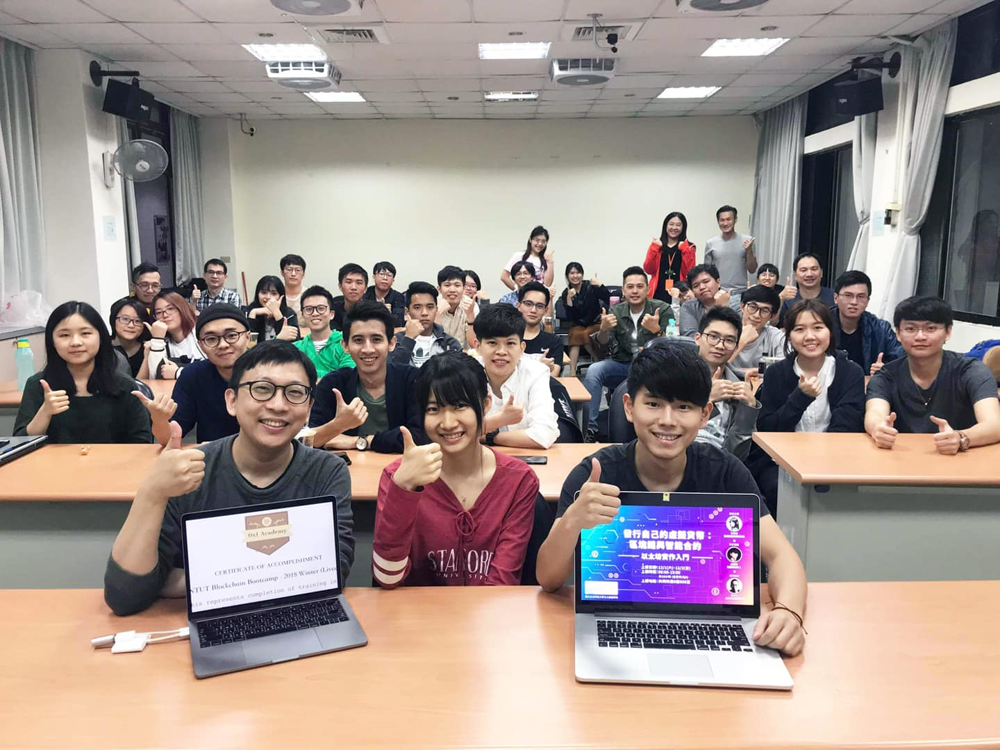

# NTUT 0x1 Blockchain Bootcamp 2018 Winter
> **最後更新：2026 年 1 月**

### 課程討論 Gitter



### 課程共筆



### 重要連結 

* Chatroom: [https://goo.gl/W9irFn](https://goo.gl/W9irFn)
* Title Slides(主投影片): [https://goo.gl/jG9KEf](https://goo.gl/jG9KEf)
* Course Slides(課程投影片): [https://goo.gl/Z4YKi1](https://goo.gl/Z4YKi1)
* 程式碼(歡迎star!)：[https://github.com/BlockchainEduNet-HK/smart-contract-repo](https://github.com/BlockchainEduNet-HK/smart-contract-repo)
* 直播記錄： [Day1](https://www.youtube.com/watch?v=xfMs2DxGKAE) / [Day2](https://www.youtube.com/watch?v=PlAsKigEv7o)

**Medium部落格：(歡迎追蹤！)**\
Tina: [https://medium.com/@tina26919742](https://medium.com/@tina26919742)\
Jeff: [https://medium.com/@jj1385jeff850527](https://medium.com/@jj1385jeff850527)\
寶博: [https://medium.com/@daaab](https://medium.com/@daaab)

**Github程式部落格：(歡迎追蹤！)**\
Tina: [https://github.com/tina1998612](https://github.com/tina1998612)\
Jeff: [https://github.com/yhuag](https://github.com/yhuag)\
寶博: [https://github.com/dAAAb](https://github.com/dAAAb)

**Facebook：(歡迎追蹤！)**\
Tina: [https://www.facebook.com/lee.ting.ting.tina](https://www.facebook.com/lee.ting.ting.tina)\
Jeff: [https://www.facebook.com/hu.yao.chieh](https://www.facebook.com/hu.yao.chieh)\
寶博: [https://www.facebook.com/dAAAb](https://www.facebook.com/dAAAb)

### 課程補充 

* OpenZeppelin模組庫: [https://github.com/OpenZeppelin/openzeppelin-solidity](https://github.com/OpenZeppelin/openzeppelin-solidity)
* SafeCounter: [https://github.com/BlockchainEduNet-HK/smart-contract-repo/blob/master/examples/basic/SafeCounter.sol](https://github.com/BlockchainEduNet-HK/smart-contract-repo/blob/master/examples/basic/SafeCounter.sol)
* 存程式碼到Github的Gist:[https://gist.github.com](https://gist.github.com/)

### 修業證書上鏈 

詳請見「[區塊鏈證書](../blockchain-apps/blockcerts.md)」

#### 使用方法

請在下方證書清單中找到自己的英文名字，長按名字拷貝連結（手機）或點擊滑鼠右鍵複製連結網址（電腦），下載 **BlockCerts App （**[**iOS**](https://itunes.apple.com/us/app/blockcerts-wallet/id1146921514?mt=8) **.** [**Android**](https://play.google.com/store/apps/details?id=com.learningmachine.android.app\&hl=en)**）**，先備份助記詞，點選右上角齒輪圖標「⚙️」，選擇「[**Add Credential**](https://play.google.com/store/apps/details?id=com.learningmachine.android.app\&hl=en)」貼上至 URL 處，按右上方「**X**」關閉回到初始頁面就會看到證書囉！點擊證書，觀看內容，點下方「**Verify**」按鈕可以在鏈上驗證證書。


BlockCerts App 搭配證書使用方法


\
或按右鍵另存 JSON 證書檔案至電腦，可到 [BlockCerts.org](http://blockcerts.org)（推薦） 或 [LearningMachine 認證頁](https://blockcerts.learningmachine.com) 上傳進行驗證。

**-**

**0x1 講師證書**

[**LEE TING TING**](http://daaab.github.io/0x1\_NTUT2018\_Dec02/LEE%20TING%20TING\_0x1\_NTUT2018\_Dec02\_Lecturer.json)

[**HU YAO CHUEH**](https://daaab.github.io/0x1\_NTUT2018\_Dec02/HU%20YAO%20CHIEH\_0x1\_NTUT2018\_Dec02\_Lecturer.json)****

****

### 證書連結

**TA 助教證書**

[**YUN FU**](https://daaab.github.io/0x1\_NTUT2018\_Dec02/YUN%20FU\_0x1\_NTUT2018\_Dec02\_TA.json)****

**-**

**駭客松冠軍證書**

[**CHIA-HSING CHEN**](https://daaab.github.io/0x1\_NTUT2018\_Dec02/CHIA-HSING%20CHEN\_0x1\_NTUT2018\_Dec02\_WINNER.json)

[**HAN-CHEN HSU**](https://daaab.github.io/0x1\_NTUT2018\_Dec02/HAN-CHEN%20HSU\_0x1\_NTUT2018\_Dec02\_WINNER.json)

[**HUNG-YI LEE**](https://daaab.github.io/0x1\_NTUT2018\_Dec02/HUNG-YI%20LEE\_0x1\_NTUT2018\_Dec02\_WINNER.json)

[**JEN-SHIANG WENG**](https://daaab.github.io/0x1\_NTUT2018\_Dec02/JEN-SHIANG%20WENG\_0x1\_NTUT2018\_Dec02\_WINNER.json)

[**KAI-WEN XU**](https://daaab.github.io/0x1\_NTUT2018\_Dec02/KAI-WEN%20XU\_0x1\_NTUT2018\_Dec02\_WINNER.json)

[**MENG-HAN LEE**](https://daaab.github.io/0x1\_NTUT2018\_Dec02/MENG-HAN%20LEE\_0x1\_NTUT2018\_Dec02\_WINNER.json)

[**PEI-YAO CHOU**](https://daaab.github.io/0x1\_NTUT2018\_Dec02/PEI-YAO%20CHOU\_0x1\_NTUT2018\_Dec02\_WINNER.json)

[**TZU-HSIN WANG**](https://daaab.github.io/0x1\_NTUT2018\_Dec02/TZU-HSIN%20WANG\_0x1\_NTUT2018\_Dec02\_WINNER.json)

[**YING-RU LIN**](https://daaab.github.io/0x1\_NTUT2018\_Dec02/YING-RU%20LIN\_0x1\_NTUT2018\_Dec02\_WINNER.json)

[**YU-SEN SHIH**](https://daaab.github.io/0x1\_NTUT2018\_Dec02/YU-SEN%20SHIH\_0x1\_NTUT2018\_Dec02\_WINNER.json)

**-**

**直播班 + 現場班：（證書內會標明，Livecast 為直播班）**

[**CHAO-TING CHEN**](https://daaab.github.io/0x1\_NTUT2018\_Dec02/CHAO-TING%20CHEN\_0x1\_NTUT2018\_Dec02.json)

[**CHE-FU LIN**](https://daaab.github.io/0x1\_NTUT2018\_Dec02/CHE-FU%20LIN\_0x1\_NTUT2018\_Dec02.json)

[**CHE-YA LI**](https://daaab.github.io/0x1\_NTUT2018\_Dec02/CHE-YA%20LI\_0x1\_NTUT2018\_Dec02.json)

[**CHEN-JIAN HSUN**](https://daaab.github.io/0x1\_NTUT2018\_Dec02/CHEN-JIAN%20HSUN\_0x1\_NTUT2018\_Dec02.json)

[**CHEN-REN HAO**](https://daaab.github.io/0x1\_NTUT2018\_Dec02/CHEN-REN%20HAO\_0x1\_NTUT2018\_Dec02.json)

[**CHEN-YO LIAO**](https://daaab.github.io/0x1\_NTUT2018\_Dec02/CHEN-YO%20LIAO\_0x1\_NTUT2018\_Dec02.json)

[**CHI-YUAN HUANG**](https://daaab.github.io/0x1\_NTUT2018\_Dec02/CHI-YUAN%20HUANG\_0x1\_NTUT2018\_Dec02.json)

[**CHIA-HSING CHEN**](https://daaab.github.io/0x1\_NTUT2018\_Dec02/CHIA-HSING%20CHEN\_0x1\_NTUT2018\_Dec02.json)

[**CHIA-MIN LIU**](https://daaab.github.io/0x1\_NTUT2018\_Dec02/CHIA-MIN%20LIU\_0x1\_NTUT2018\_Dec02.json)

[**CHIA-YIN LIU**](https://daaab.github.io/0x1\_NTUT2018\_Dec02/CHIA-YIN%20LIU\_0x1\_NTUT2018\_Dec02.json)

[**CHIN-HSIEN HSIEH**](https://daaab.github.io/0x1\_NTUT2018\_Dec02/CHIN-HSIEN%20HSIEH\_0x1\_NTUT2018\_Dec02.json)

[**CHOU SUHAO**](https://daaab.github.io/0x1\_NTUT2018\_Dec02/CHOU%20SUHAO\_0x1\_NTUT2018\_Dec02.json)

[**CIAO-YI GUO**](https://daaab.github.io/0x1\_NTUT2018\_Dec02/CIAO-YI%20GUO\_0x1\_NTUT2018\_Dec02.json)

[**FUNG CHUNG YAN**](https://daaab.github.io/0x1\_NTUT2018\_Dec02/FUNG%20CHUNG%20YAN\_0x1\_NTUT2018\_Dec02.json)

[**HAN-CHEN HSU**](https://daaab.github.io/0x1\_NTUT2018\_Dec02/HAN-CHEN%20HSU\_0x1\_NTUT2018\_Dec02.json)

[**HAN-XIN LIU**](https://daaab.github.io/0x1\_NTUT2018\_Dec02/HAN-XIN%20LIU\_0x1\_NTUT2018\_Dec02.json)

[**HSIEN-SHENG LEE**](https://daaab.github.io/0x1\_NTUT2018\_Dec02/HSIEN-SHENG%20LEE\_0x1\_NTUT2018\_Dec02.json)

[**HSIN-YING PENG**](https://daaab.github.io/0x1\_NTUT2018\_Dec02/HSIN-YING%20PENG\_0x1\_NTUT2018\_Dec02.json)

[**HUI-FENG HSIAO**](https://daaab.github.io/0x1\_NTUT2018\_Dec02/HUI-FENG%20HSIAO\_0x1\_NTUT2018\_Dec02.json)

[**HUI-YANG YONG**](https://daaab.github.io/0x1\_NTUT2018\_Dec02/HUI-YANG%20YONG\_0x1\_NTUT2018\_Dec02.json)

[**HUNG-YI LEE**](https://daaab.github.io/0x1\_NTUT2018\_Dec02/HUNG-YI%20LEE\_0x1\_NTUT2018\_Dec02.json)

[**JEN-SHIANG WENG**](https://daaab.github.io/0x1\_NTUT2018\_Dec02/JEN-SHIANG%20WENG\_0x1\_NTUT2018\_Dec02.json)

[**JHENG-LUN WU**](https://daaab.github.io/0x1\_NTUT2018\_Dec02/JHENG-LUN%20WU\_0x1\_NTUT2018\_Dec02.json)

[**JING-WEI CHEN**](https://daaab.github.io/0x1\_NTUT2018\_Dec02/JING-WEI%20CHEN\_0x1\_NTUT2018\_Dec02.json)

[**JUN-CHENG-JIAN**](https://daaab.github.io/0x1\_NTUT2018\_Dec02/JUN-CHENG-JIAN\_0x1\_NTUT2018\_Dec02.json)

[**KAI-WEN XU**](https://daaab.github.io/0x1\_NTUT2018\_Dec02/KAI-WEN%20XU\_0x1\_NTUT2018\_Dec02.json)

[**MAO-HSUN SUN**](https://daaab.github.io/0x1\_NTUT2018\_Dec02/MAO-HSUN%20SUN\_0x1\_NTUT2018\_Dec02.json)

[**MENG-HAN LEE**](https://daaab.github.io/0x1\_NTUT2018\_Dec02/MENG-HAN%20LEE\_0x1\_NTUT2018\_Dec02.json)

[**MIN-SIANG JHAN**](https://daaab.github.io/0x1\_NTUT2018\_Dec02/MIN-SIANG%20JHAN\_0x1\_NTUT2018\_Dec02.json)

[**MIN-YEN HSIEH**](https://daaab.github.io/0x1\_NTUT2018\_Dec02/MIN-YEN%20HSIEH\_0x1\_NTUT2018\_Dec02.json)

[**PEI-CHUN YUAN**](https://daaab.github.io/0x1\_NTUT2018\_Dec02/PEI-CHUN%20YUAN\_0x1\_NTUT2018\_Dec02.json)

[**PEI-YAO CHOU**](https://daaab.github.io/0x1\_NTUT2018\_Dec02/PEI-YAO%20CHOU\_0x1\_NTUT2018\_Dec02.json)

[**PEI-YING WU**](https://daaab.github.io/0x1\_NTUT2018\_Dec02/PEI-YING%20WU\_0x1\_NTUT2018\_Dec02.json)

[**QING-JIN WANG**](https://daaab.github.io/0x1\_NTUT2018\_Dec02/QING-JIN%20WANG\_0x1\_NTUT2018\_Dec02.json)

[**SHU-CHUAN CHANG**](https://daaab.github.io/0x1\_NTUT2018\_Dec02/SHU-CHUAN%20CHANG\_0x1\_NTUT2018\_Dec02.json)

[**SUNG-YI WEI**](https://daaab.github.io/0x1\_NTUT2018\_Dec02/SUNG-YI%20WEI\_0x1\_NTUT2018\_Dec02.json)

[**TING-WEI CHENG**](https://daaab.github.io/0x1\_NTUT2018\_Dec02/TING-WEI%20CHENG\_0x1\_NTUT2018\_Dec02.json)

[**TING-WEI CIOU**](https://daaab.github.io/0x1\_NTUT2018\_Dec02/TING-WEI%20CIOU\_0x1\_NTUT2018\_Dec02.json)

[**TZU-HSIN WANG**](https://daaab.github.io/0x1\_NTUT2018\_Dec02/TZU-HSIN%20WANG\_0x1\_NTUT2018\_Dec02.json)

[**WAN-PING CHEN**](https://daaab.github.io/0x1\_NTUT2018\_Dec02/WAN-PING%20CHEN\_0x1\_NTUT2018\_Dec02.json)

[**WAYNE CHIU**](https://daaab.github.io/0x1\_NTUT2018\_Dec02/WAYNE%20CHIU\_0x1\_NTUT2018\_Dec02.json)

[**WEN-CHUN CHUNG**](https://daaab.github.io/0x1\_NTUT2018\_Dec02/WEN-CHUN%20CHUNG\_0x1\_NTUT2018\_Dec02.json)

[**WEN-SHIN LIN**](https://daaab.github.io/0x1\_NTUT2018\_Dec02/WEN-SHIN%20LIN\_0x1\_NTUT2018\_Dec02.json)

[**XIN-HONG CHEN**](https://daaab.github.io/0x1\_NTUT2018\_Dec02/XIN-HONG%20CHEN\_0x1\_NTUT2018\_Dec02.json)

[**YI ANN CHEN**](https://daaab.github.io/0x1\_NTUT2018\_Dec02/YI%20ANN%20CHEN\_0x1\_NTUT2018\_Dec02.json)

[**YI CHEN**](https://daaab.github.io/0x1\_NTUT2018\_Dec02/YI%20CHEN\_0x1\_NTUT2018\_Dec02.json)

[**YI-CHENG CHEN**](https://daaab.github.io/0x1\_NTUT2018\_Dec02/YI-CHENG%20CHEN\_0x1\_NTUT2018\_Dec02.json)

[**YI-CHUN WEI**](https://daaab.github.io/0x1\_NTUT2018\_Dec02/YI-CHUN%20WEI\_0x1\_NTUT2018\_Dec02.json)

[**YIN LIEN**](https://daaab.github.io/0x1\_NTUT2018\_Dec02/YIN%20LIEN\_0x1\_NTUT2018\_Dec02.json)

[**YING-RU LIN**](https://daaab.github.io/0x1\_NTUT2018\_Dec02/YING-RU%20LIN\_0x1\_NTUT2018\_Dec02.json)

[**YONG-YU LI**](https://daaab.github.io/0x1\_NTUT2018\_Dec02/YONG-YU%20LI\_0x1\_NTUT2018\_Dec02.json)

[**YU-CHENG HUANG**](https://daaab.github.io/0x1\_NTUT2018\_Dec02/YU-CHENG%20HUANG\_0x1\_NTUT2018\_Dec02.json)

[**YU-HENG SHIH**](https://daaab.github.io/0x1\_NTUT2018\_Dec02/YU-HENG%20SHIH\_0x1\_NTUT2018\_Dec02.json)

[**YU-SEN SHIH**](https://daaab.github.io/0x1\_NTUT2018\_Dec02/YU-SEN%20SHIH\_0x1\_NTUT2018\_Dec02.json)

[**YUE-TING CAI**](https://daaab.github.io/0x1\_NTUT2018\_Dec02/YUE-TING%20CAI\_0x1\_NTUT2018\_Dec02.json)

[**YUN-AN CHEN**](https://daaab.github.io/0x1\_NTUT2018\_Dec02/YUN-AN%20CHEN\_0x1\_NTUT2018\_Dec02.json)

[**YUN-SHAN TSAI**](https://daaab.github.io/0x1\_NTUT2018\_Dec02/YUN-SHAN%20TSAI\_0x1\_NTUT2018\_Dec02.json)

**-**

**>>** [**使用方法**](https://www.0x1.academy/-LRGqRpaO05clgxM6SQN/0x1-workshop/0x1-ntut-blockchain-bootcamp-2018-dec#shi-yong-fang-fa) **<<**

### **幕後花序**





---

#### 相關條目

<!-- TODO: 添加 3-5 個相關頁面連結 -->

#### 參考資料

<!-- TODO: 添加外部參考連結 -->
