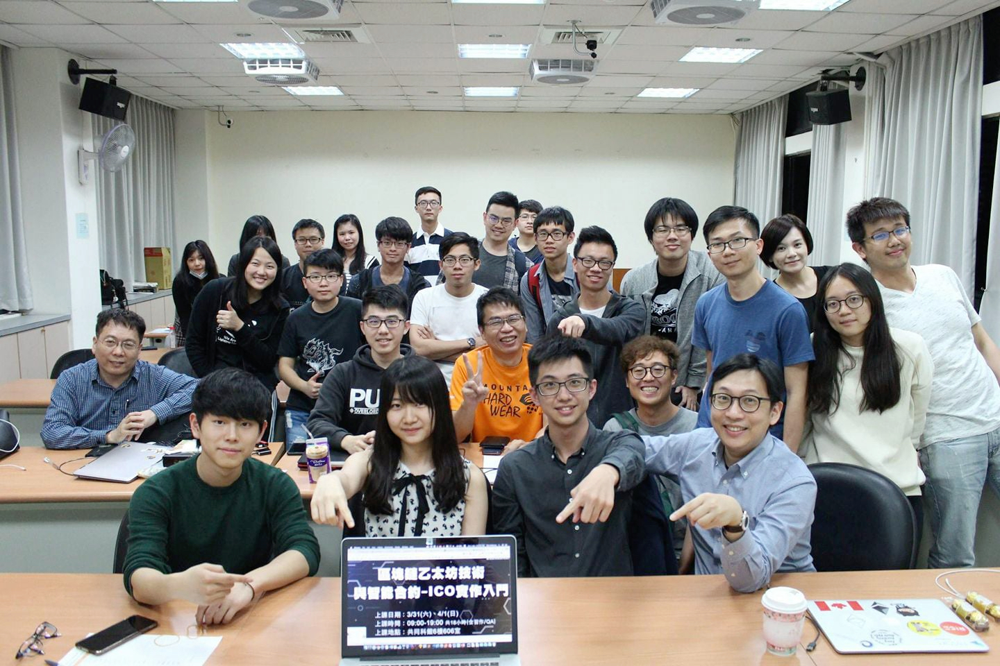

# 0x1區塊鏈課程

## \[進行中] 區塊課 EP4 - 北科大 2019 春季區塊鏈微學分班兩日工作坊

.png>)

#### **主題：「**區塊鏈智能合約與區塊鏈遊戲時做：從 0 到 1 玩轉 EOS 區塊鏈**」**

#### **地點：北科大 | 時間：**2019/05/18 (六) 至 05/19 (三) 共計兩天18小時，時間為早上 9:00 - 晚上 18:00

臉書宣傳： [https://www.facebook.com/photo.php?fbid=10213746225592919](https://www.facebook.com/photo.php?fbid=10213746225592919\&set=a.1191671914996\&type=3\&av=1324335231\&eav=AfYBAonygB6mlZXR4nAPikyzEwLicBjR2uwRY6TbpVMij6QNdEXpVCKiJdOpSlDUMjs)\
報名連結： [https://reurl.cc/grobz](https://reurl.cc/grobz)（**145 人報名，錄取 15 人 -- 錄取率 10%**）

## \[進行中] 區塊課 EP3 - 台大 2019 共教中心學分課

.png>)

#### **主題：「**國立臺灣大學【進階軟體開發專題：0x1 區塊鏈課應用實戰班】**」**

#### **地點：台大 | 時間：**2019/02/20 (三) 至 06/19 (三) 共計18週，時間為早上 9:00 - 12:00

臉書宣傳： [https://www.facebook.com/dAAAb/posts/10213109653199007](https://www.facebook.com/dAAAb/posts/10213109653199007)****\
****台大課綱： [http://ceiba.ntu.edu.tw/1072CSX5001\_ ](http://ceiba.ntu.edu.tw/1072CSX5001\_)\
報名連結： [http://se.piee.pw/ET5KS](http://se.piee.pw/ET5KS)（**152 人報名，錄取 15 人 -- 錄取率 9.8%**）

### **\[已結束]** 區塊課 EP2 - 北科大 2018 冬季區塊鏈微學分班兩日工作坊

#### **主題：「發行自己的虛擬貨幣：區塊鏈與智能合約-以太坊實作入門」**

#### **地點：北科大 | 時間：2018/12/1 \~ 2018/12/2（兩天）**

臉書宣傳： [**https://www.facebook.com/dAAAb/posts/10212705939346413**](https://www.facebook.com/dAAAb/posts/10212705939346413)\
報名連結： [https://goo.gl/Rrqv9H](https://goo.gl/Rrqv9H)（300 人報名，錄取 30 人 -- 錄取率 10%）\
課後心得： [https://medium.com/@daaab/c5a61f5ee625](https://medium.com/@daaab/c5a61f5ee625)

### **\[已結束]** 區塊課 EP1 - 北科大 2018 春季區塊鏈微學分班兩日工作坊&#x20;

.png>)

**主題：「區塊鏈以太坊技術與智能合約-ICO實作入門」**

#### 地點：北科大 | 時間：2018/3/31\~4/1（兩天）

臉書宣傳： [https://www.facebook.com/dAAAb/posts/10211232189103578](https://www.facebook.com/dAAAb/posts/10211232189103578)\
報名連結： [https://goo.gl/q6q13L](https://goo.gl/q6q13L)（120 人報名，錄取 20 人 -- 錄取率 16.6%）

