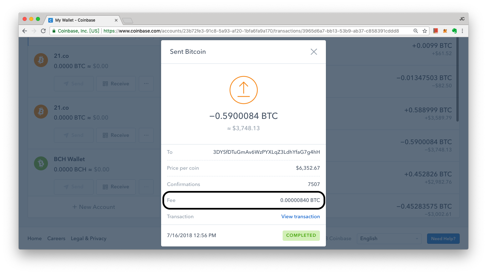
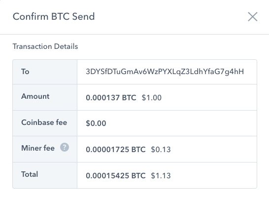
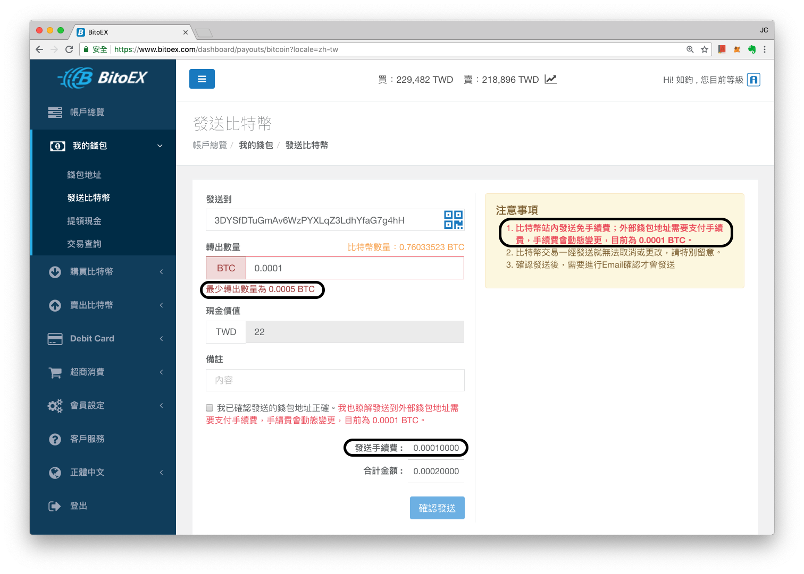

# 礦工費用

**礦工費用（英文：Miner's Fee）**其實就是交易手續費，在以太坊區塊鏈裡，多半都用[燃料費](../yi-tai-fang-bao/wa-si.md)（Gas Fee）來說明，但比特幣區塊鏈因為沒有燃料的概念，也幾乎沒有什麼分散試算力、智能合約的設計，所以每筆交易就單純是送出一筆轉帳記錄，由礦工幫忙打包記帳。所以多半就直接用礦工費來說明。

比如上面這張比特幣區塊歷史記錄瀏覽器 [BlockCypher 所顯示的這筆寶博士 2018 年 7 月的轉帳](https://live.blockcypher.com/btc/tx/90be883b2446aa3237e3b156c11a93e51bad9dff54fdaca4ac3b2a5567e0379a)，一共轉了 0.59 BTC 給對方，另外就包含了 0.00000840 BTC 的手續費（Fee），以當時現價一枚 BTC 約等於 $6,352.67 美金，等於是花了新台幣 1.6 元的轉帳費。相比郵局的 7~15 跨行轉帳費，國際轉匯百來元台幣不等的費用，這可以說是相當便宜的一種價值交換方法。

### 關於比特幣錢包轉帳

比特幣轉帳時所付出的礦工費，在 Coinbase 上會很明確的說明所有轉帳費都會直接付出給礦工，然而有些交易所或比特幣代存平台為了保障每筆轉帳交易都能達到對方手中，會加高礦工費用甚至行政手續費，讓轉帳者的負擔增加，但安全性提高。

Coinbase 轉帳頁面顯示手續費為 0.0001725 BTC，大約是美金 0.13 ，新台幣 4 元左右：

同一時間，要轉同一筆帳，在幣託（BitoEx）交易所需要的手續費則一律為 0.0001 BTC，約為新台幣 20 元：

也是因為這個原因，許多交易所都有轉出最低金額的要求，否則可能會有使用者惡意轉移多筆金額為 0 的比特幣，造成網路塞車，礦工費用飆漲，到最後可能交易所來不及調高手續費，便會被突然增高的手續費給壓垮。


要注意，多半的比特幣購物收付款都會要求使用者用「比特幣錢包」付款，意思就是希望使用者不要用交易所錢包，而是使用原生錢包 APP，內有私鑰的這種，一來有的交易所為了省錢，可能每次的礦工費用都設超低讓帳很晚才到對方那裏，二來使用者也無法為了提高交易速度調整礦工費。相較之下，用原生比特幣錢包 APP 就能夠解決這個問題。


