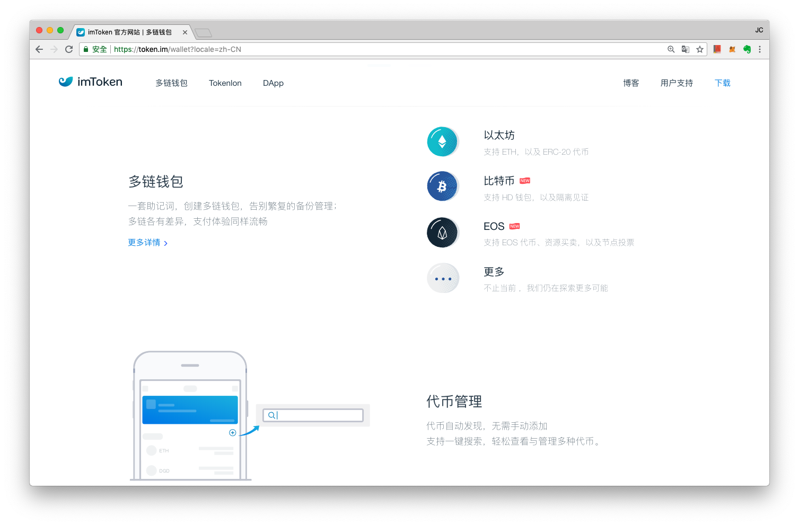

# 多鏈錢包

**多鏈錢包，有時又稱作多幣錢包（英文：Multi-Chain Wallet）**也有人稱作多幣錢包或聚合錢包**（Multi-Coins Wallet 或 Multi-Currency Wallet）**，意思是同一個程式或裝置可以存放不同鏈上的資產。

### Trust Wallet

舉例而言，先前的 Trust Wallet 就只能存放以太坊虛擬貨幣 - 以太幣和 ERC20 幣，但被幣安交易所併購後，就一舉升級成為了多幣錢包，現在裡頭也能存放 Ethereum Classic \(ETC\) POA Network \(POA\) Callisto \(CLO\) GoChain \(GO\) 等多種鏈上的資產。

### imToken

而大中華地區最多人使用的區塊鏈錢包之一 imToken 也在 2018 年 6 月份推出了多幣錢包國際版 - imToken 2.0 



注意：如果你的比特幣錢包是使用明文私鑰導入的, 那麼才有導出比特幣私鑰功能, 如果你是使用助記詞導入或者從 imToken 中生成的 BTC 錢包, 那麼只有導出助記詞功能。

錢包怎麼選？

由於除了在自己的電腦上架設節點程式，將全部系統都掌控在自己手上之外，其餘任何方法保存或取得私鑰都有一定的風險；即便自己架設節點，也有電腦被入侵或偷走的可能，因此在區塊鏈 1.0 的世代，目前幾乎沒有任何方法可以確保「錢包 APP」裡的資產的安全。除了私鑰完全儲存在硬體內的「硬體冷錢包」以外，所謂的錢包 APP 都有資產風險存在。但我們多半還是需要一個隨時可以帶著到處走的錢包，隨時可以交易、[玩遊戲](../qu-zhong-xin-hua-yong-dapp/undefined-1.md)或是[認養貓](../qu-zhong-xin-hua-yong-dapp/cang-collectibles/jia-mi-cryptokitties.md)。

### 以下是寶博士對於錢包 APP 的挑選建議

1. 確認該 APP 是否有開源 - 如 Coin.Space （現今越來越少開源錢包，因為都被大公司併購了，而且開源不代表就一定安全，只代表裡面如果藏有偷取私鑰的機制，會被其他熱心的 Coder 發現。但事實上，Coder 不一定會發現，發現了也不一定會說。只是至少比完全不知道程式裡頭是不是有私下儲存備份你私鑰的閉源程式要來得... 透明一些。）
2. 用大家都用的那個 APP
3. 用最大的公司出的 APP
4. 用一旦這個 APP 出問題，大家的錢也都會出問題的 APP
5. 下載前看一下 APP 評價和下載數
6. 千萬不要下載來路不明的錢包！

   千萬不要下載來路不明的錢包！

   千萬不要下載來路不明的錢包！

7. 千萬不要在不知名的網站上生成錢包地址和私鑰



  
目前寶博士最推薦的應該是 Coinbase 剛推出的 Wallet App。Coinbase 作為全球最早也最大的區塊鏈虛擬貨幣公司，若是程式有問題，大概整個市場就會瞬間失去信心。所以它的錢包應該是相對最安全的。（缺點是沒有中文）



  
目前最多人用的中文多鏈錢包大概屬於前面提到的 imToken 2.0 了，大家也可以試試看。

