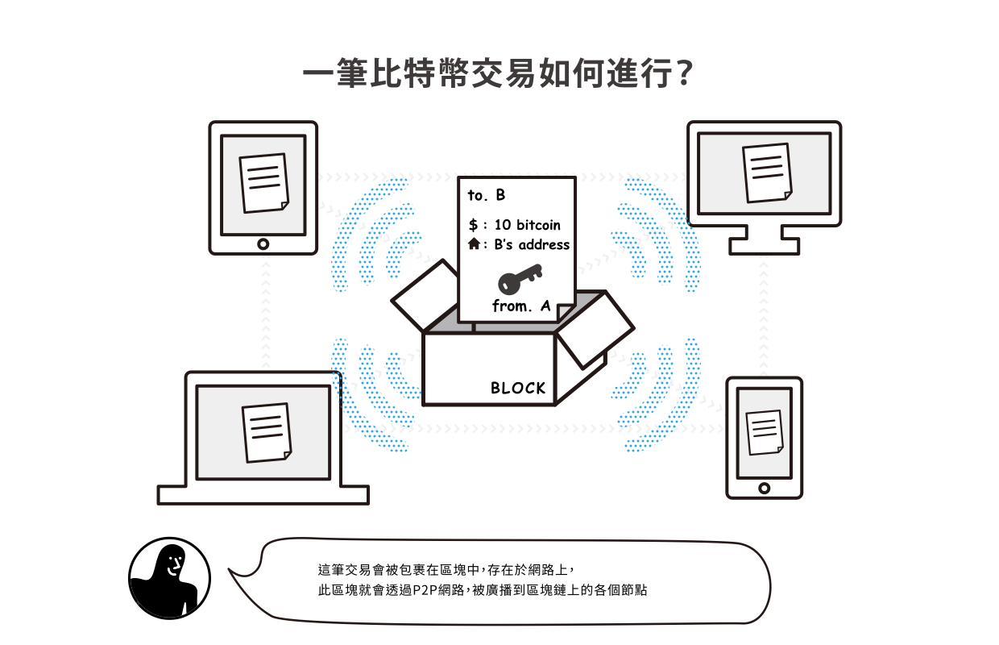
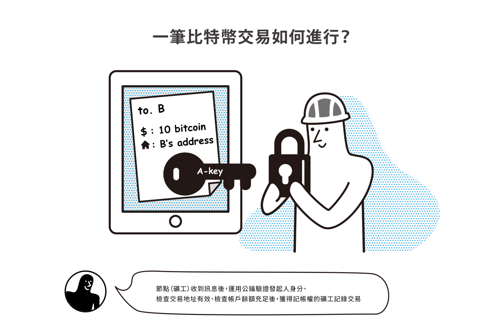
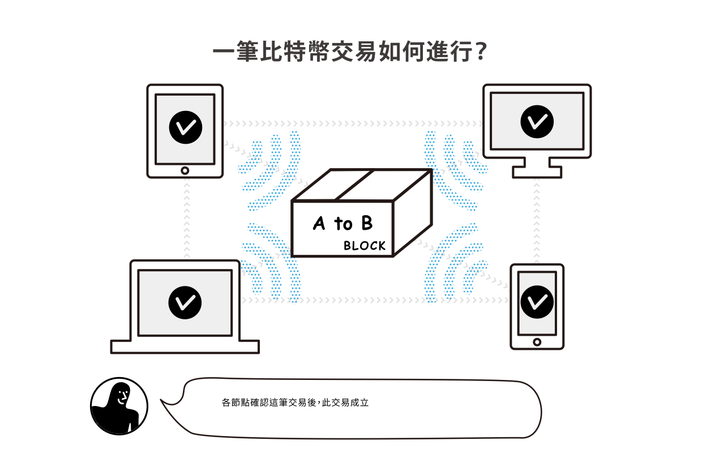
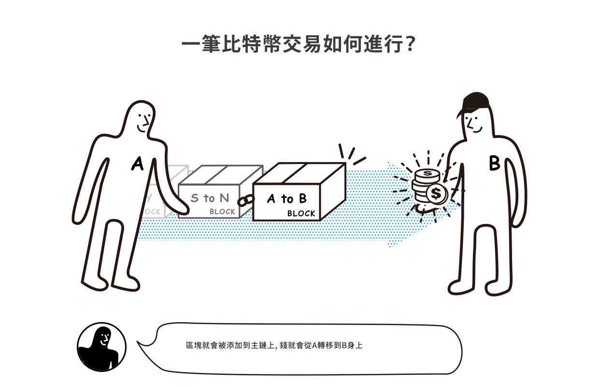

# 送出交易

以下幾個條目將會依序介紹使用虛擬貨幣（數位資產）電子錢包進行交易時，會經歷的幾個步驟。注意，這裡所提到的交易是以「轉帳交易」為主，和交易所裡的「[撮合交易](../../jiao-yi-suo/cuo-he-jiao-yi.md)」是不一樣的喔。

送出交易（英文：Submit Transaction）指的是在電子錢包裡填入要轉帳的「[錢包地址](../bao-di-zhi.md)」、「[交易手續費](shou.md)」、和「交易金額」資料後，就能對區塊鏈發起一筆交易。

發起交易後，區塊鏈會先收到請求，回覆「交易哈希（交易編號）」接著等待區塊鏈帳本記錄者（礦工）將這筆交易打包，此時送出交易者的交易狀態會顯示「等待完成交易」的階段，在區塊鏈上則會顯示「交易（已收到申請）未確認」，此時其實多半情況都會交易成功，也稱作「零確認交易階段（英文：Zero confirmation）」等一段時間後，就會顯示交易確認，也就代表帳本已經確切的記錄下，而且經過檢查，雙方交易前後的餘額都和帳本先前的紀錄一致，就算交易成功了。

### 一筆交易如何進行？數位時代「300秒區塊鏈麻瓜大變身」圖解

在數位時代雜誌 2018 年區塊鏈特輯所製作的圖解裡頭，對於區塊鏈交易的流程說明得十分清楚。




**注意！**

1. 所謂區塊鏈上所進行的「交易」有時候不是數位資產，而只是數位資料的紀錄更新。就如同前面條目「[幣](../../undefined.md)」所說，錢財在社會的意義只是記錄每個人的工作所得，也就其實只是數字的增間更新而已。因此這個分散式帳本技術，不只可以記錄錢的交易，任何記錄上的變更，數字、資料的更替，也都可以用區塊鏈技術來達成可以信賴的記錄。
2. 上面最後一張圖說之所以寫「轉移（記錄）」也是要強調，在區塊鏈上「數位資產」的轉移，其實沒有真的「轉移」，而是帳本裡頭，交易雙方的紀錄變更了。例如：A 轉了 50 元給 B，其實是在區塊鏈帳本的記錄上，變更為：A 的資產減少 50 ，B 的資產增加 50 。這是非常重要的觀念，在「[比特幣](../../bi-te.md#bi-te-shi-zhen-de)」條目中也有提到過。


