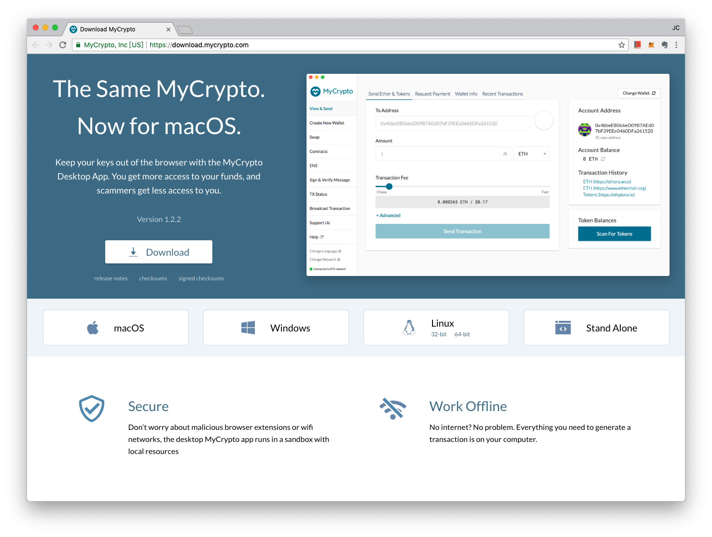

# MyCrypto

2018 年 2 月 9 日，最多人使用的 [MEW（MyEtherWallet）](myetherwallet.md) 線上錢包服務突然出現了內部分裂，以共同創辦人之一 Monahan 為首的一組人馬從中分裂出來，突然之間創辦了一模一樣的服務 - [MyCrypto.com](https://MyCrypto.com) 。

{% embed data="{\"url\":\"http://bit.ly/2wtZd0s \",\"type\":\"link\",\"title\":\"MyEtherWallet創辦人分道揚鑣 另創新錢包MyCrypto成競爭對手 - 區塊客\",\"description\":\"台北時間今日突傳出網頁錢包MyEtherWallet「分叉（fork）」出新錢包MyCrypto的消息。MEW是由Kosala Hemachandra及Taylor Monahan二人於2015年創立，Monahan今早突然宣布她將帶領由她所組建的團隊經營新錢包品牌MyCrypto。\",\"icon\":{\"type\":\"icon\",\"url\":\"https://i0.wp.com/cdn.blockcast.it/wp-content/uploads/2017/04/21203715/b\_logo.png?fit=180%2C180&ssl=1\",\"width\":192,\"height\":192,\"aspectRatio\":1},\"thumbnail\":{\"type\":\"thumbnail\",\"url\":\"https://i0.wp.com/cdn.blockcast.it/wp-content/uploads/2018/02/09231346/27625351\_1410924789030199\_5011876917353093608\_o.jpg?fit=1674%2C917&ssl=1\",\"width\":1674,\"height\":917,\"aspectRatio\":0.5477897252090801}}" %}

截至目前，MyCrypto 的發展狀況堪稱良好，許多優質的區塊鏈專案如 [Livepeer](../../../yong-bang/livepeer.md) 等，在官方教學裡使用的創建錢包或使用錢包功能的部分都是選用 MyCrypto，而非較為人知的 [MEW](myetherwallet.md)。

[MyCrypto](http://MyCrypto.com) 近來發展用心，在右上角增添了多國語言，也增加了簡體中文和繁體中文的選項。此外，對於 MEW 警告但保留的「貼上私鑰」和「匯入 Keystore」等錢包瀏覽方法，[MyCrypto](http://MyCrypto.com) 已不再支援（見上圖上方英文字），而是改推出一樣開放源碼的 [MyCrypto Desktop App（桌面應用程式）](https://download.mycrypto.com/)讓使用者可以完全在自己的電腦裡離線操作錢包，無需經過瀏覽器甚至無需連線上網，免除瀏覽器被駭或被剪貼簿病毒程式奪走私鑰的風險。

{% embed data="{\"url\":\"http://bit.ly/2MyTyBn \",\"type\":\"link\",\"title\":\"木馬程式Evrial透過修改剪貼簿內容竊取比特幣 - 區塊客\",\"description\":\"最近外國網路安全團隊發現一隻新型木馬程式，它可以修改剪貼簿中的加密貨幣地址，當用戶使用「複製/貼上」地址來進行交易時，可能會將資金送入駭客的口袋之中。\",\"icon\":{\"type\":\"icon\",\"url\":\"https://i0.wp.com/cdn.blockcast.it/wp-content/uploads/2017/04/21203715/b\_logo.png?fit=180%2C180&ssl=1\",\"width\":192,\"height\":192,\"aspectRatio\":1},\"thumbnail\":{\"type\":\"thumbnail\",\"url\":\"https://i0.wp.com/cdn.blockcast.it/wp-content/uploads/2018/01/24124559/trojan-horse.jpg?fit=780%2C494&ssl=1\",\"width\":780,\"height\":494,\"aspectRatio\":0.6333333333333333}}" %}

[MyCrypto 桌面應用程式](https://download.mycrypto.com/)（支援 Mac, Windows, Linux 跨平台）而且可以完全離線使用！相對安全許多。

下載位址： [https://download.mycrypto.com/](https://download.mycrypto.com/) 



