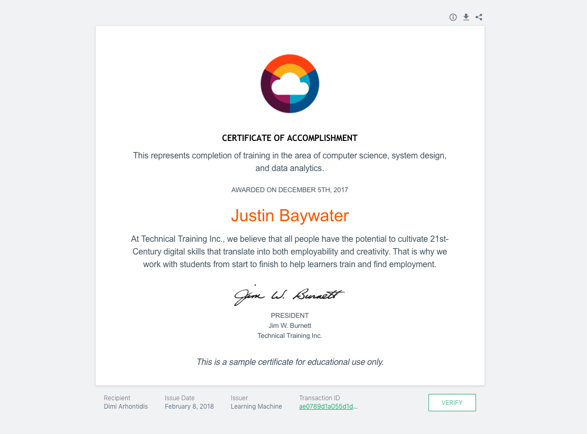
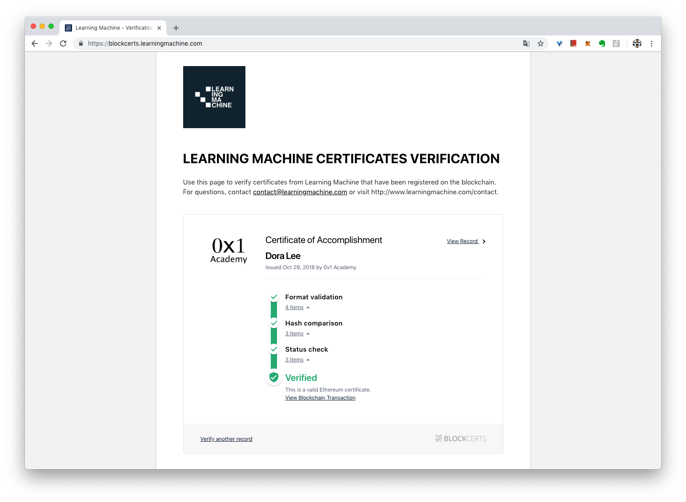

# BlockCerts

[Blockcerts](https://www.blockcerts.org/) 是一個由  [MIT’s Media Lab](http://learn.media.mit.edu/) 麻省理工學院學習實驗室 和 [Learning Machine](http://www.learningmachine.com/) 公司共同開發的開源區塊鏈證書專案。透過區塊鏈（目前支援比特幣和以太坊兩種鏈）發放課程修業或各種證書。



### 線上測試

點擊 [這裡](https://blockcerts.learningmachine.com/certificate/75a731e9942652d6b1d61bcc371b3644)，再點選畫面右下角的「Verify」按鈕，即可鏈上驗證。

### 更多範例



## 0x1 學院製作的證書範例（進行中）

下載以下兩個證書檔案（JSON 格式）





到把下載後的 JSON 檔案拖曳到以下兩個開放驗證的網站

1. [https://www.blockcerts.org/](https://www.blockcerts.org/)
2. [https://blockcerts.learningmachine.com/](https://blockcerts.learningmachine.com/)

應該會得到類似這樣的驗證結果：

你也可以利用 Blockcerts 推出的 [iOS](https://itunes.apple.com/us/app/blockcerts-wallet/id1146921514?mt=8) / [Android](https://play.google.com/store/apps/details?id=com.learningmachine.android.app&hl=en) 手機證書瀏覽/驗證程式，隨身攜帶你的證書。

* [下載 iOS 手機「Blockcerts」](https://itunes.apple.com/us/app/blockcerts-wallet/id1146921514?mt=8)
* [下載 Android 手機「Blockcerts」](https://play.google.com/store/apps/details?id=com.learningmachine.android.app&hl=en)

### 待完成

* [ ] 線上展示網頁（參考下方 Repo）



* [ ] 下載、分享證書
* [ ] 線上申請及 Email 通知

### 其他資源

[https://btcert.com/home](https://btcert.com/home) 



