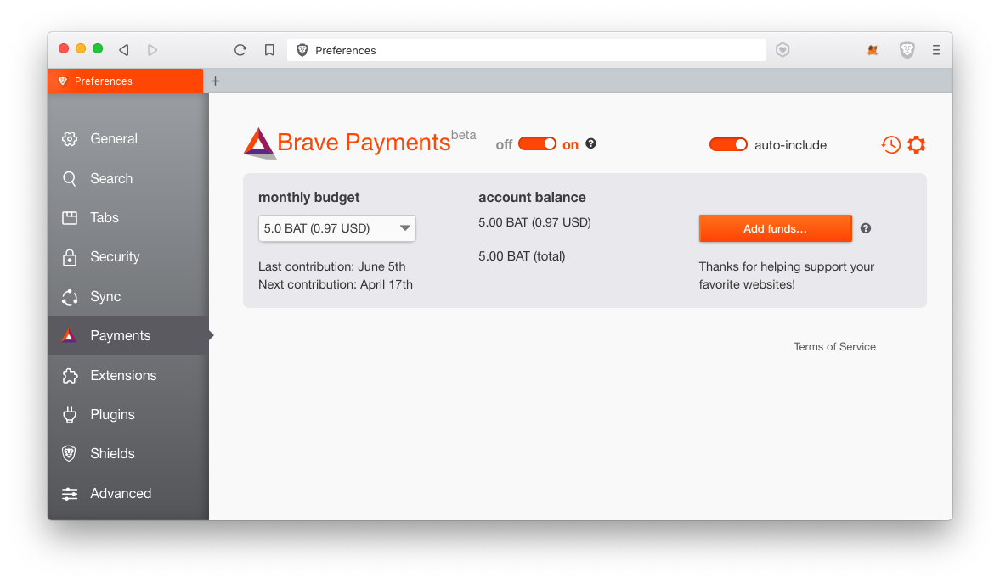

# Brave
> **最後更新：2026 年 1 月**

Brave 是個由[Mozilla專案](https://zh.wikipedia.org/wiki/Mozilla)的聯合創始人、[JavaScript](https://zh.wikipedia.org/wiki/JavaScript)的創造者[布蘭登·艾克](https://zh.wikipedia.org/wiki/%E5%B8%83%E8%98%AD%E7%99%BB%C2%B7%E8%89%BE%E5%85%8B) 打造的新世代瀏覽器，其內建反追蹤、去廣告等功能外，還引入了區塊鏈錢包以及用來獎勵內容創作者的 BAT \(Basic Attention Token\) 區塊鏈貨幣。

知名網友美勞哥在 2019/3/18 曾[盛讚 Brave 瀏覽器的網頁瀏覽速度](https://www.facebook.com/evenwu/posts/10156024635055718)。

[Brave](https://brave.com/xac187) 還推出了 Brave Reward 讓推薦使用者下載使用瀏覽器的推廣者每個月都可以收到區塊鏈虛擬貨幣 BAT 的獎勵。如果你有興趣測試，歡迎使用 0x1.academy 的[**專屬推廣連結下載 Brave**](https://brave.com/xac187). 



如果你自己本身就是頻道主或內容產製者，想讓你的粉絲都下載 Brave 用 Brave 來看你生產的網路內容，那麼你也可自己申請一個推廣連結來獲取 BAT 喔！：



---

#### 相關條目

<!-- TODO: 添加 3-5 個相關頁面連結 -->

#### 參考資料

<!-- TODO: 添加外部參考連結 -->
