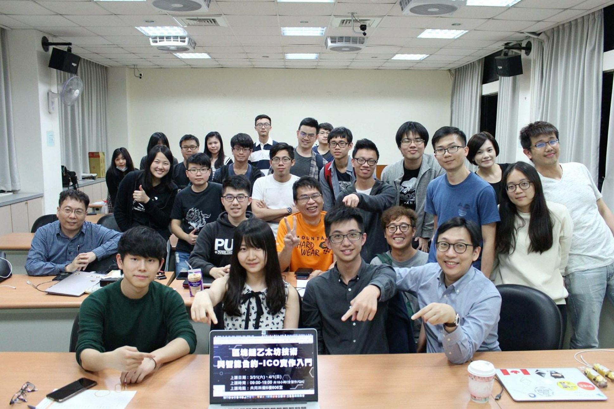

# 前言

矽谷創投教父 Marc Andresson 在 1994 年創辦 Mosaic 公司，發明人類歷史上第一個受到廣大用戶歡迎的「網景（ Netscape）」網際網路瀏覽器）；他與 Ben Horowitz 共同創立 a16z 投資機構，現已成當今矽谷最積極投入區塊鏈及數位資產投資的風險投資公司。2017 年底在拉斯維加斯舉辦的 a16z 年會當中， Marc Andresson 透過專業經理人發佈了他對區塊鏈科技的觀點：

> "2017 年的區塊鏈（數位資產）產業，就像 1994 年的網際網路"

他又說

> "當我 1994 年來到矽谷，以為一切都為時已晚，網路產業已經再也沒有我的位置。"

看見了嗎？當年他以為來得太晚，但對照史實，卻其實來得正是時候，他在 1994 年創辦了 Netscape，改變了一整個網路世代和當今人類的生活方式（沒有 Netscape，就沒有 IE, 沒有 Chrome 也不會有後來的雅虎、Amazon，Google）。

### 歡迎來到 1995！

2018 年的現在，你可能正在扼腕怨嘆沒有更早參與區塊鏈、比特幣、以太坊的盛宴，但別忘了，依照瀏覽器的發明人 Marc Andresson 的說法，現在還只是 1995 年的矽谷啊！（或以科技的指數加速定律而言，很可能才是 1994 年的聖誕節！）

### 泡沫來了？

很多人既期待又怕受傷害，因為泡沫，對這個趨勢裹足不前；但看看 2000 年的達康網路泡沫（Dot-Com Internet Bubble）在爆破前 6 年，誕生了 Amazon - 1994 年創辦，如今是世界上市值最高的公司之一；泡沫後 6 年出現了 Facebook，後者近幾年猛烈成長，如今已成為 20億使用者人口帝國。

回頭來看區塊鏈科技，如果它要改變世界，勢必面臨泡沫化的威脅，但在泡沫前與泡沫後，都肯定誕生足以改變人類生活、顛覆社會、重塑富比士財富榜的巨型企業和傳奇人物吧。

### 指南

不少朋友對區塊鏈領域有興趣，但卻缺乏一個門路理解各種術語如「PoS Pow」「零知識證明」「51 攻擊」或是各種迷因（Meme）諸如「笑來割韭菜」「xDite 買三宅」「To the Moon 還是 To the 墓」等等。這對 "進圈" 又造成了更多的阻力。

這本書希望能夠成為一個簡易的便車指南，只要隨手翻翻、查閱，就能不只理解區塊鏈技術基礎，還能透過輕鬆詼諧的區塊鏈迷因整理，將幣鏈圈中過去、現在、未來發生大小事皆朗朗上口，瞬間不明覺厲。

### 緣起

寶博士和芝加哥經濟學博士，也是現任 [SELF CHAIN](http://selftoken.co) 計畫的首席經濟學家 -  Tom Lam 從 2013 年開始就多次在線上討論比特幣、2014 年於奇點大學首次以 $650 美金購入第一顆比特幣，到 2017 年投入多個 ICO 計畫獲得良好成效，直至 2018 年共同參與如 SELF CHAIN, LeadBest 等多個區塊鏈計畫，完整經歷「幣」「鏈」圈洗禮，並且在北科大以專任教職身分偕同 Jeff Hu, Tina Lee 這對鏈圈知名的神鵰俠侶，率先一開校內百年來首堂區塊鏈課程「區塊鏈以太坊技術與智能合約-ICO實作入門」，吸引數十位包含台大、北科大、政大以及上海就學學生，以及多位新創公司創辦人，技術長等蒞臨旁聽。

我們期待把這些年的觀察、經歷，透過一本小書，一本隨時可以在通勤時閱讀、在上廁所裡隨手翻閱，一本讓更多的人可以帶的區塊鏈入門小書，成就自信，跨入那個看起來難懂其實一點就通的幣圈、鏈圈，也帶著自信，進入這個產業投資、創造甚至就職，加入這個正在高速通往泡沫浴池，但肯定會在泡沫破滅後誕生改變人類社會的企業的產業裡，一起創造未來，全新的可能。

### 閱讀

《0x1 Blockpedia（暫）》這本小書，是為了普羅大眾、財經背景人士或是所有對區塊鏈產業有興趣的人撰寫的圖文百科，為了讓更多人能容易瞭解幣鏈圈現象，並進而 "入圈"，因此做了幾點設計：

1. **項目標題不加英文**： 除了幾個重要的例如「瞭解你的用戶（KYC）」罕見地在中文標題後加上英文縮寫標註之外，其餘的都盡可能依據 Wikipedia 的原則，標題保留地方語言（如此版是中文，則僅會在標題上寫中文）降低翻閱上的大腦刺激與知識門檻。 
2. **加入逗趣的詞語和名人瑣事**： 如「藍寶堅尼」「幣圈一天，人間三年」等等，希望讓一些圈子無論線下活動或線上社群裡口語表達的內容，和談話的材料，也能輕易被掌握、發揮並理解。 
3. **條目順序經過寶博士精心設計**： 一般的百科條目都是用年份、字母等排序，然而區塊鏈世界因為沾染了許多資訊科學、密碼學、經濟學甚至社會科學等原理，若是以一般百科的「無理排序」，恐怕容易造成理解上的困難，是故本書採用特別編輯過的順序來列出條目，讓人閱讀第 21 條時所需要的知識，必在第 21 條前已講述過。

### 提醒

不少網友或朋友在談天時均會對區塊鏈提出質疑「不是說好了『去中心化』嗎？為何現在的交易所說暫停就暫停？」「不是說好了『不可竄改』嗎？為何還是有的遊戲能夠修改參數？」「不是說好了可以『解決信任問題』嗎？那為何還是有詐騙發生呢？」

區塊鏈不是萬能，區塊鏈是很棒的科技；但它僅是能夠將「現有技術能做的 - 做到更好」。就如同汽車比馬車更快，Email 比實體郵件更方便，但過往的舊科技（馬匹、信件、銀行）可能發生的意外、風險、人為問題依舊有。

千萬記住：區塊鏈不是萬靈丹，也不是人類最完美的最終技術答案。這只是人類千萬年發展歷史上，又一個重大突破和現有技術改良而已。但即便是這樣，它已經值得我們投入一輩子。

{% embed url="https://medium.com/@tempofeng/%E5%8D%80%E5%A1%8A%E9%8F%88%E4%B8%8D%E8%83%BD%E8%A7%A3%E6%B1%BA%E7%9A%84%E4%BF%A1%E4%BB%BB%E5%95%8F%E9%A1%8C-5aa47f590acf" %}

## 歡迎來到新世界，你準備好了嗎？

1994 年的網際網路，西風東漸；2017 年的區塊鏈世界，從技術到數位資產發行，全是東方味濃厚。比特幣的發明人「中本聰」聽起來是個日文名；2017 年的數位資產發行濫觴以及現今全球最大交易所都在中國；全球最大數位資產發行技術所使用的以太坊區塊鏈網路，其中至少有一半的開發者其實是在台灣，香港也有很棒的計畫在進行中。一切都在預示那傳中中，二十一世紀的東方龍，或許就是區塊世界的那條鏈。筆者期待這本小書能夠幫助更多人，一起將這場風暴共同吹起，從東方再次吹向西方，創造一個更好的世界。

