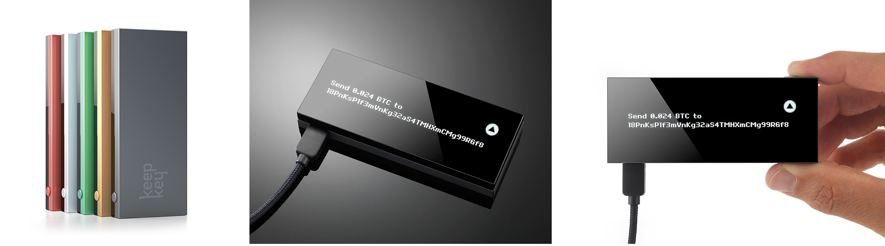

# KeepKey
> **最後更新：2026 年 1 月**

****[**KeepKey**](https://shapeshift.io/keepkey/) **是一間美國公司，製作非常具有設計感的同名硬體錢包「**[**KeepKey**](https://keepkey.myshopify.com/)**」，後在 2017 年 8 月被瑞士的一間數位資產交換公司** [**ShapeShift**](https://shapeshift.io) **併購。**

 (1).png>)





---

#### 相關條目

* [Ledger Nano S/X](ledger-nano.md)
* [CoolWallet S](coolbitx.md)

#### 參考資料

<!-- TODO: 添加外部參考連結 -->
