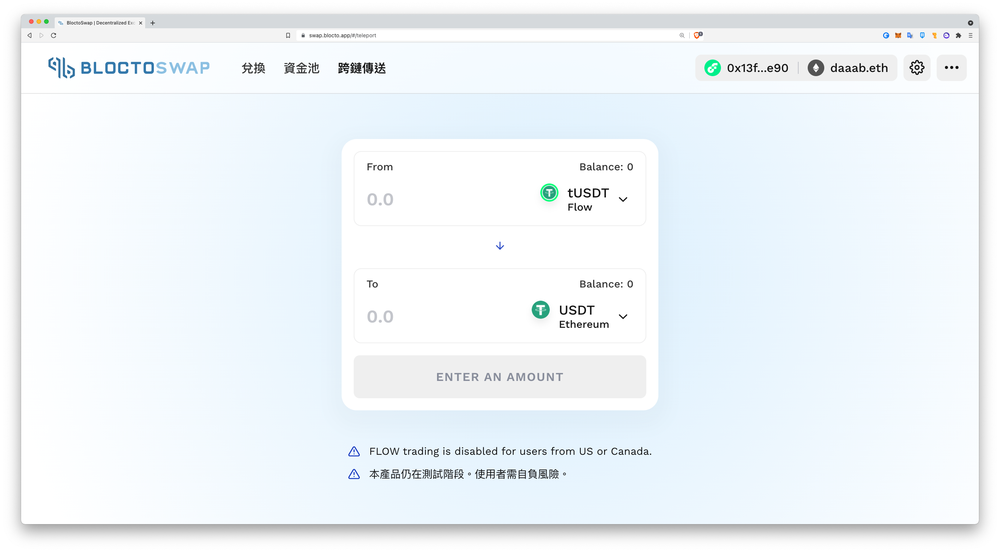

# 跨鏈交易
> **最後更新：2026 年 1 月**

**跨鏈交易（Chain Bridge）是讓不同區塊鏈之間的資產能夠互相轉換的技術，又稱跨鏈轉換（Chain Swap）或原子交換（Atom Swap）。**

一個鏈就像一種資料庫，跨鏈交換資產就像「跨資料庫」互轉資料。例如：SQL 跟 MongoDB 只要寫好 I/O Bridge ，資料還是可以互相移轉。鏈跟鏈的資產只要有人寫好跨鏈機制（Atom Swap） 就能互轉。



中心化交易所（例如幣安）裡面多半的交易對都沒有真正的交換，就像銀行並沒有真的拿黃金存摺裡的錢去買黃金，但去中心化交易所跟 NFT 交易所跨鏈，就是用原子交換的機制在做，目前我的理解例如 ETH/FLOW 就有同質代幣互轉 USDT/FUSD，並沒有 NFT 跨鏈轉換，但技術上應該可行。

例如臺灣 Blocto 錢包的 BloctoSwap 就提供 FLOW 鏈和 ETH 鏈的轉換，注意下圖右上角，同時掛載了 FLOW 和 ETH 兩個錢包：

---

#### 相關條目

* [前言：為什麼寫這本書](blockpedia.md)
* [如何閱讀本書](how-to-read.md)

#### 參考資料

<!-- TODO: 添加外部參考連結 -->
