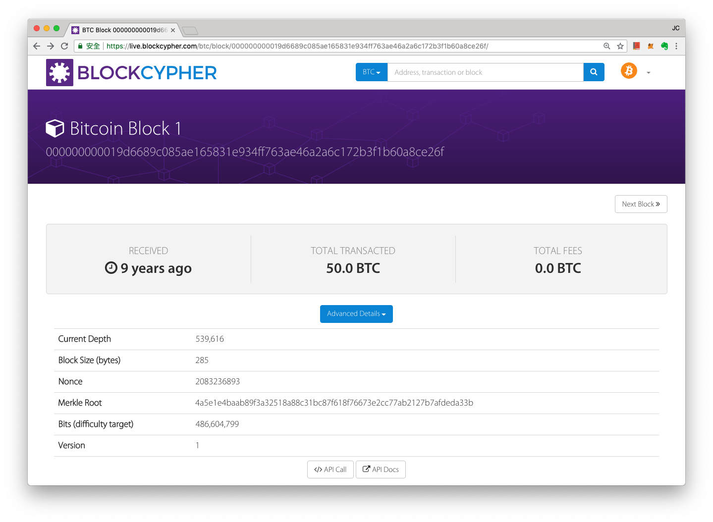
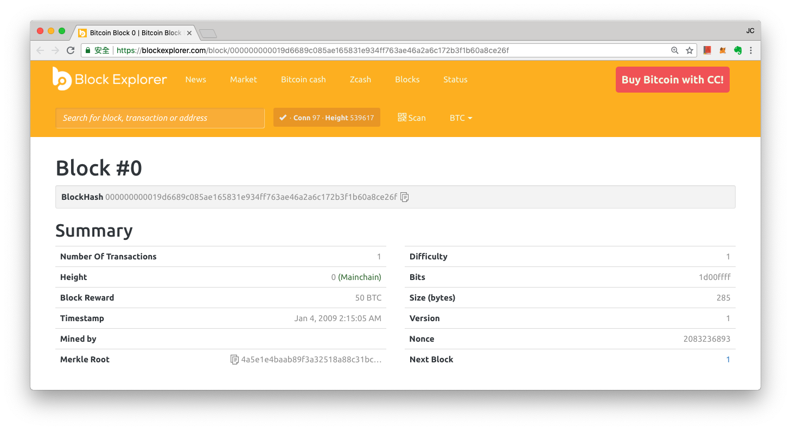
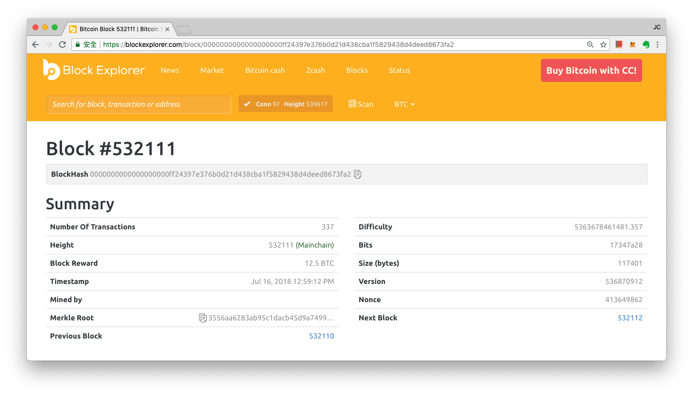
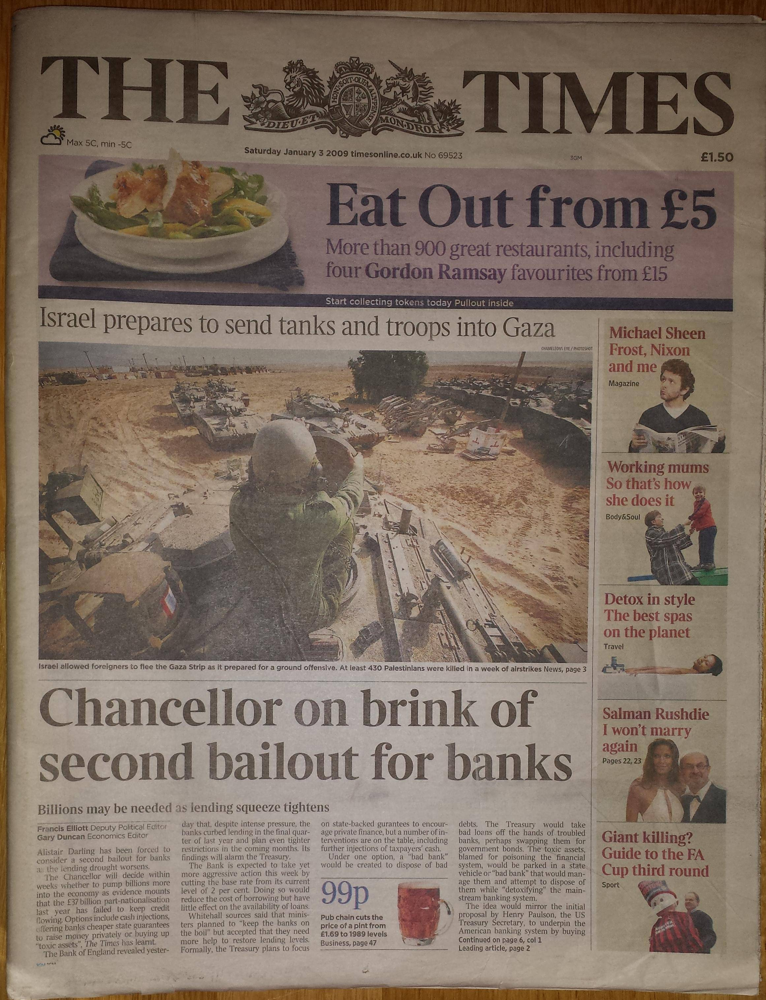

# 創世區塊

**創世區塊（英文：Genesis Block）**，指是一個區塊鏈網路的初始區塊，也就是帳本的第一頁。

比特幣的創世區塊在台灣時間 2009 年 1 月 4 日清晨 2 點 15 分 5 秒，化名中本聰（Satoshi Nakamoto）的比特幣主要作者，製作了比特幣世界的第一個區塊—  "創世區塊"（Genesis block），新版本的比特幣系統將它設定為 0 號區塊，而舊版本的比特幣系統設定它的序號為 1。

一個帳本記錄伊始，需要有一筆帳被記錄，因此中本聰轉了 50 比特幣獎金給了一個地址，從此區塊鏈便這樣運作起來。

從另外一個比特幣區塊鏈記錄瀏覽器裡，還可以看到多一些資料：

創世交易被記錄下來的挖礦難度（Mining Difficulty）是 1，而挖礦獎金（Block Reward）是 50 比特幣，且區塊哈希（Block Hash）前面僅有 9 個連續的零。

相較今年（2018）寶博士的一筆交易：

在編號第 532111 的區塊中，這筆交易被礦工記錄下來的挖礦難度是 5363678461481.357 ，挖礦獎勵經過中本聰初始設計的逐漸調降，已將為 12.5 比特幣，而同樣代表難度的區塊哈希編號前共有 19 個連續的零，代表一個礦工要能成功打包這個區塊的交易，它所列舉的哈希數字要和這個區塊提交時的哈希編號做二次哈希時得在新的哈希字串前有 19 個連續的零。

### 區塊裡的祕密

在[創世區塊](https://live.blockcypher.com/btc/block/000000000019d6689c085ae165831e934ff763ae46a2a6c172b3f1b60a8ce26f/)裡，中本聰留下了自己的一句話：

The Times 03/Jan/2009 Chancellor on brink of second bailout for banks。  
此刻 03/Jan/2009 正是英國財政大臣達林被迫考慮第二次出手紓解銀行危機的時刻。

這句話是《泰晤士報》當天頭版文章標題。中本聰的引用，既是對該區塊產生時間的說明，也是對金融危機巨大壓力下，舊有的脆弱銀行系統的冷嘲。



