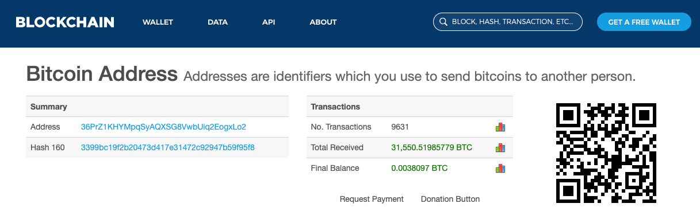

# 丟掉的片段

### 為什麼要出這本書？

說實話，自己在開始撰寫時，也抱持著兩個問題「為何市場上沒有給麻瓜的區塊鏈百科？（連線上的都沒有，更何況一本印刷精美的小書）」以及「為何 VR 沒有？區塊鏈就要有？」

我的理解是 - 區塊鏈太新、而且懂得技術的人不一定懂得背後的故事，懂得故事的人不一定寫得出來。不是沒有人能做這件事，而是剛好沒有，也剛好還沒有。

而區塊鏈並非最近幾年唯一的指數成長的科技，其他還有虛擬實境、人工智慧等等，但為何就區塊鏈科技需要這樣的圖解百科呢？我的答案是：虛擬實境和人工智慧都還在找尋他們的市場機會（Product Market Fit），其勢必先巨大地影響一個產業，再來才會影響到所有人。相比起來，區塊鏈技術的市場機會已經十分明確，就是金融市場、經濟社會，而這兩點恰恰是足以影響每個人生活，也足以滲透至每個產業的基石。基於這一點，區塊鏈科技的深度和廣度和其它正在發展中的新興科技比起來，絕對是有過之無不足。若要選一個科技，務必讓更多產業、更多人可以理解的，一定就非區塊鏈莫屬了。

## 區塊鏈

區塊鏈（英語：Blockchain）是一種透過電腦網路運行的密碼學技術，透過這種技術，建立了比特幣，只要讓電腦安裝**區塊鏈特製程式**，就能讓不需要村長、不需要銀行、政府掛保證的虛擬貨幣、數位資產首次在人類歷史上運行起來。

區塊鏈技術主要核心就是能夠做到類似帳本紀錄的功能，每「一定數量**彼此串連的一組交易記錄**（又稱區塊）」又會串連著前面「一定數量**彼此串連的一組交易記錄」，**區塊連著區塊，就像帳本的每一頁連著前一頁，頁面中的每筆帳又都連著前一筆帳，一旦加以竄改，就會使得帳目不平，系統就會發生密碼學上的驗證錯誤，交易就不會成功，直到下一筆要掛上來的新的「一定數量**彼此串連的一組交易記錄（區塊）**」和上一個頁面（區塊）間的帳目沒問題為止。

### 區塊鏈帳本與傳統帳本的差異

簡單講在於

1. 密碼學的驗證（詳見[哈希](dev/cryptography/hash.md)）
2. 存放於數位空間所以理論上沒有容量（頁數）限制（註）
3. 通常不會只有一本帳本，而是會有好多同樣的帳本的分身，來確保不會發生[村長問題](zhong-xin-hua-ben.md#cun-le)
4. 分身帳本之間彼此連接多半透過網路，所以不會有這村那店的帳本不同的問題


註：頁數太厚可能會導致分散式帳本建立速度變慢。見「[分散式帳本](fen-san-shi-ben.md)」「[節點](dev/zhu/undefined-9/)」和「[全節點](dev/zhu/undefined-9/quan.md)」


## 幣圈

其實最早的幣圈並不是這樣的，原先的幣圈和鏈圈並沒有分得那麼開，有許多懂技術的鏈圈開發者，也對於幣價的上漲，有更多人關注這個圈子感到很開心。但到了 2017 年底左右，大牛市（漲幅巨大的時期）來臨，許多原先只是看熱鬧的人突然間還沒有完整理解區塊鏈的理念和技術，就賺了一大筆錢，很多更早就踏入數位資產投資的人，也是意外的得到了數十倍，甚至數百倍的報酬

## 以太幣

根據 [Read01](https://read01.com/zh-tw/O0DQaK.html#.W1mW9dgzbQg) 的資料記載：

> 從2014年7月24日起，以太坊進行了為期42天的以太幣預售，一共募集到31,531個比特幣，根據當時的比特幣價格摺合1843萬美元，是當時排名第二大的眾籌項目。
>
> 預售時所使用的比特幣地址是 [36PrZ1KHYMpqSyAQXSG8VwbUiq2EogxLo2](https://www.blockchain.com/btc/address/36PrZ1KHYMpqSyAQXSG8VwbUiq2EogxLo2)，在比特幣區塊鏈瀏覽器里可以看到每一筆轉入和轉出。

> 在預售前兩周一個比特幣可以買到 2000 個以太幣，一個比特幣能夠買到的以太幣數量隨著時間遞減，最後一周，一個比特幣可以買到 1337 個以太幣。最終售出的以太幣的數量是 60,102,216。另外還有 0.099x（x = 60102216 為發售總量）個以太幣被分配給在 BTC 融資之前參與開發的早期貢獻者，另外一個 0.099x 將分配給長期研究項目。所以以太坊正式發行時有 60102216 + 60102216\*_0.099\*_2 = 72002454 個以太幣。
>
> 自上線時起，在POW（工作量證明機制）階段，計劃每年最多有60102216 \* 0.26 = 15,626,576 個以太幣被礦工挖出。1~2 年內轉成 [PoS（權益證明機制）](consensus/pos.md)後，每年產出的以太幣將大為減少，甚至可以不再增發新幣。  
>   
> 原文網址：[https://read01.com/O0DQaK.html](https://read01.com/O0DQaK.html)

## ERC20

### 來源？

2015 年 11 月 18 日，一名代號 ethers 的開發者在以太坊開發者社群內提議參考 1969 年以來的網路開發社群一直沿襲下來的「協議提出討論」系統（例如如今的網際網路 TCP/IP 協定就是編號第 793 和 791 號 RFC - Request for Comment）。



