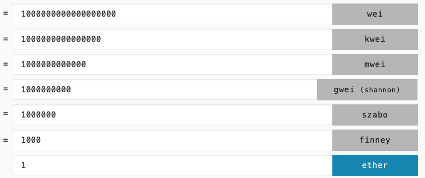

# 以太幣

**以太幣（ETH, 或稱 Ether）是目前全球第二大數位貨幣，也是**[**以太坊**](ethereum.md)\*\*\*\*[**主網**](blockchain-dev/mainnet.md)**（亦即以太坊區塊鏈）內支付交易費和手續費的唯一貨幣，可以用**[**挖礦**](wa/)**的方式取得，也可以在**[**交易所**](jiao-yi-suo/)**直接購買。**

比較需要瞭解的是，因為以太坊技術容許第三方開發者在以太坊區塊鏈上開發、發行自己的數位貨幣（[山寨幣](tong/shan-zhai.md) Alt Coin，又稱 另類貨幣）且共用以太坊區塊鏈做分散式帳本的記帳，因此這些山寨幣的轉帳費、流通交易費等等，也被限制只能使用以太幣來給付。

在這情況下，變成要發行山寨幣、購買山寨幣或賺帳山寨幣做流通前，使用者都需先行安裝[以太坊錢包](wallet/yi-tai-fang-bao/)，並購買以太幣，這樣便使得以太幣整體來說，供給大於需求，價格便持續上漲。

註：後來有了[交易所](jiao-yi-suo/)後，使用者就幾乎可以用任何虛擬貨幣，兌換售出或買入任何虛擬貨幣。（詳見 [幣幣交易](jiao-yi-suo/jiao-yi/) ）。

### 發行四年，暴漲 4000 倍

[根據記錄](https://www.quora.com/What-was-the-price-of-Ether-on-Ethereum-presale)，以太幣於 2014 年 7 月 22 日至 2014 年 9 月 2 日進行為期 [42](mi-yin/21000000/42.md) 天的線上預售， 原始發行價約為 0.3 美元（當時是以 1 比特幣兌換 1000 ~ 2000 個以太為基準），2018 年 1 月 9 日，以太幣來到歷史最高價：1 ETH = 1,423.20 美元。

#### 總結算來，以太幣自 2014 年發行以來，最高暴漲 4,000 倍。

目前（2018 年 7 月 26 日）的比特幣價格則為 $481.19 美元。

### 以太幣的特性

雖說以太幣上市時宣稱是下一個世代貨幣，讓人容易誤以為是下一個比特幣，然而實情卻是，比特幣模擬黃金，而以太幣則更接近一般流通貨幣。下表比較它與比特幣不同之處：

|  | **以太幣** | **比特幣** |
| :--- | :--- | :--- |
| 區塊鏈網路 | 以太坊區塊鏈 | 比特幣區塊鏈 |
| 總量限制 | 無（每年最多增發 1200 萬 ETH ） | 有（永恆時間內僅 2100 萬枚比特幣） |
| 增發機制 | 有 | 無 |
| 最小單位 | 小數點後 18 位 | 小數點後 8 位 |
| 交易速度 | 快（正常約 10 ～ 30秒內） | 慢（正常約 10~ 60 分鐘） |
| 相關應用 | 很多（遊戲，募資） | 極少（多半為支付） |
| 創辦人 | [Vitalik](mi-yin/vitalikv-shen.md)（V 神，活躍度高） | [中本聰](mi-yin/zhong-ben/)（匿名，無下落） |
| 基金會 | 以太坊基金會 | 比特幣基金會 |
| 機制 | 中心化 | 去中心化 |
| 共識證明 | PoW ‣ PoS | PoW |

### 以創辦人 V 神為中心？

以太幣目前全球發行量已達一億枚： 100,927,956 ETH （[2018 年 7 月 26 日](https://coinmarketcap.com/currencies/ethereum/)），而可視全球流通狀況，每年由以太坊基金會決定增發數量（不超過 1500 萬），因而被許多人質疑是一種中心化的設計。然而有另一種說法則稱，由於每年增發數量亦有上限，也可以某種程度說是有上限，而非無限。

比較具體的差異還有另外一點，則是以太坊的設計目前可以說是空前成功，帶起了數以百億計的數位資產發行市場，然而以太幣的生殺大權和設計思維依然集中在某個依然在世，且活躍度頗高的 Vitalik （V 神）身上；反觀比特幣則沒有這樣的一位 "神"，相對是更加去中心化的。這部份的說法，目前還很難有反駁之處。雖然以太坊基金會曾經推動 DAO 這樣的去中心化組織來平衡這個中心化的問題，但在代碼有缺陷的狀態下，這個設計目前算是宣告失敗了。

### 以太幣的單位

由於 1 ETH（一個以太幣）由 A 轉帳給 B 的過程當中，需要支付以太坊區塊鏈網路些許的轉帳交易手續費，而這個手續費的數字要麼是小數點後好多個零，如：0.0000000001 ETH 的數字；要麼是有個奇怪的英文單位 Gwei。這是初入門以太幣和其他第三方貨幣時最不容易理解的部份。

我們先初步瞭解一下，最常用到的 Gwei，其實就是 1,000,000,000（十億）Wei，而 Wei 呢，就是以太幣的最小切分單位，以密碼學家戴偉（D. Wei）命名，他於 1998 年發表的 [B Money 網路論文](http://www.weidai.com/bmoney.txt) 啟發了中本聰於比特幣區塊鏈中的不少設計，Wei 就像美金的最小單位 = 1 cent（美分），台幣的最小單位 = 1 毛。而從另一個角度看，1 Gwei，又等於 0.000000001 ETH（數學表示法：10 ^ -9 ETH） 。

比較表如下：

#### 參考資料

關於以太幣/以太坊的誤用，以及一些背後的小故事，推薦這篇文章：



## 以太幣單位轉換器：



