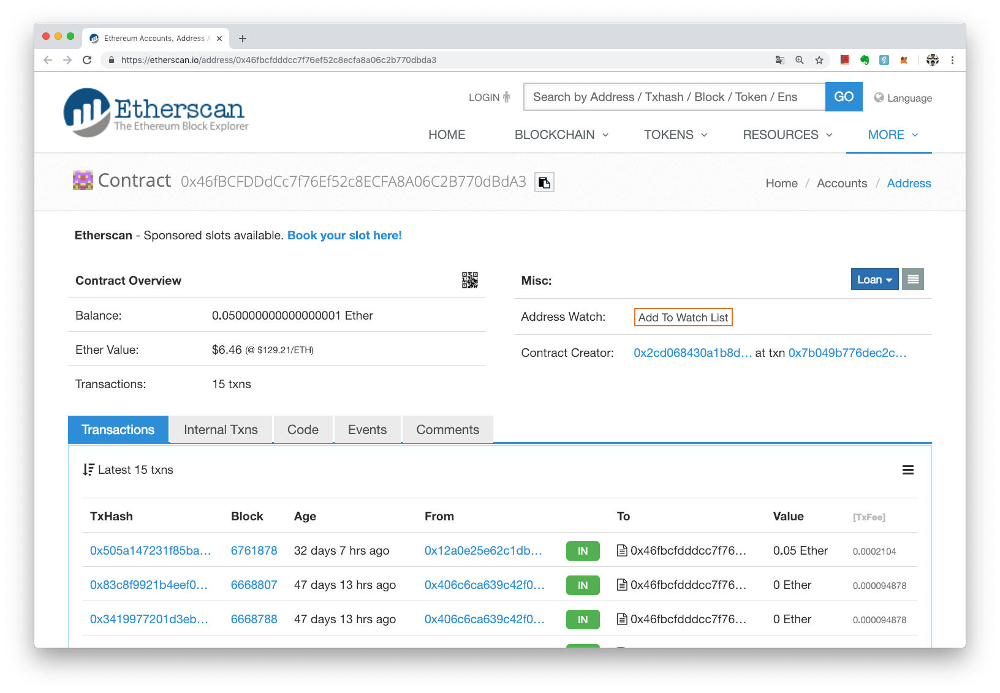

# 合約地址
> **最後更新：2026 年 1 月**

智能合約部署到區塊鏈後，會被存放在區塊鏈上的一個獨有地址，所有想與該智能合約互動者，均需透過此地址找到該智能合約。

在以太坊上的合約地址一般長得和[錢包地址](../wallet/address.md)一樣，都是 0x 開頭，所以初學者經常會搞錯。不過如果是合約地址，在 Etherscan 網站左上方就會顯示「合約（Contract）」字樣，如寶博士的灑幣合約：

地址：[0x46fbcfdddcc7f76ef52c8ecfa8a06c2b770dbda3](https://etherscan.io/address/0x46fbcfdddcc7f76ef52c8ecfa8a06c2b770dbda3)



---

#### 相關條目

* [Solidity](solidity.md)

#### 參考資料

<!-- TODO: 添加外部參考連結 -->
