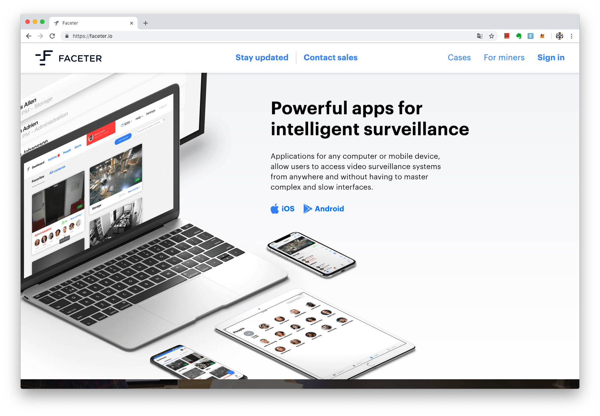

# 概念證明
> **最後更新：2026 年 1 月**

概念證明（Proof of Concept）有時候又被稱作最小可行性產品（Minimum Viable Product）。是項目方提出項目時，希望為了讓預購贊助者相信項目方在募資的同時，已經擁有具有價值的產品雛形或是一定的開發能力/開發團隊，因此較成功的項目，皆有推出概念證明。如：

Faceter 項目就在項目募資時就推出了 Faceter.io 這個 APP



簡言之，在數位資產發行項目熱潮過後，贊助者對項目方的完成度和認真度要求越來越高，要求「概念證明」就是這個趨勢帶來的變化之一。

---

#### 相關條目

* [基石輪](ji-shi.md)
* [私募輪](si-mu.md)

#### 參考資料

<!-- TODO: 添加外部參考連結 -->
