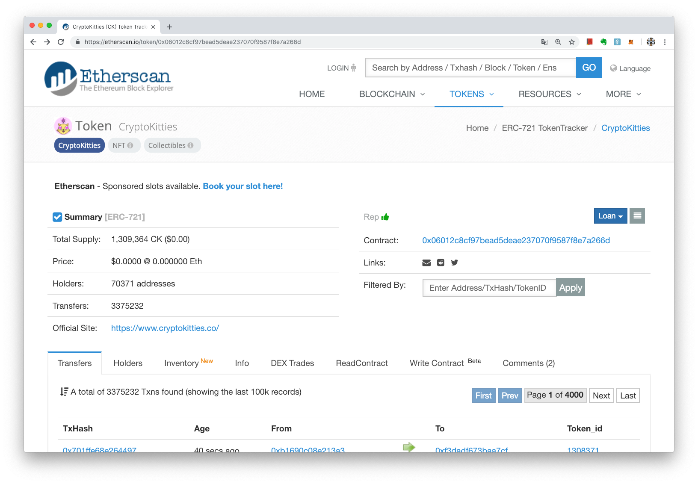

# 通證
> **最後更新：2026 年 1 月**

區塊鏈通證是區塊鏈代幣的另一種稱呼。原因是在以太坊區塊鏈上，可付出以太幣作為使用費，由智能合約創建合約地址，向以太坊區塊鏈註冊並依約產生一種新的「代幣」並且給予相關屬性、名稱和代號。這些「註冊產生的代幣」在以太坊的系統上，通稱為 Token，中文翻譯可以是「通證」或「令牌」。

通證的概念原先就存在一般資訊系統上，例如 Facebook 應用程式開發者需要在用戶同意下，向系統申請取得通證（Access Token）多半是一串英數代碼，就可持該通證進入系統進行某些操作。



區塊鏈系統利用的類似概念，創建了不同類型的 Token，也就是不同類型的通證或令牌，如 ERC20 Token，就是 ERC20 類的令牌，ERC721 就是 ERC721 類的令牌。而該類令牌有預先設定好的屬性和行為，開發者呼叫該類令牌的創建合約，創建該類型的令牌，又可以依據喜好取不同的名稱。

如 [SELF TOKEN](https://etherscan.io/token/0x67ab11058ef23d0a19178f61a050d3c38f81ae21) 就是 ERC20 Token，名稱為「SELF TOKEN」代號為「SELF」數量為「200,000,000」  
創建通證的合約地址是 [0x67ab11058ef23d0a19178f61a050d3c38f81ae21](https://etherscan.io/token/0x67ab11058ef23d0a19178f61a050d3c38f81ae21) 

如 [CryptoKitties](https://etherscan.io/token/0x06012c8cf97bead5deae237070f9587f8e7a266d) 就是 ERC 721 Token，名稱為「CryptoKitties」代號為「CK」數量為「1,309,364」  
創建通證的合約地址是 [https://etherscan.io/token/0x06012c8cf97bead5deae237070f9587f8e7a266d](https://etherscan.io/token/0x06012c8cf97bead5deae237070f9587f8e7a266d)


注意看本文兩張圖的左上方，都顯示無論是 SELF TOKEN 還是 CryptoKitties，對於以太坊系統來說，都是通證（Token）的一種，只是類型不同，作用不同，名稱也不一樣。


---

#### 相關條目

<!-- TODO: 添加 3-5 個相關頁面連結 -->

#### 參考資料

<!-- TODO: 添加外部參考連結 -->
