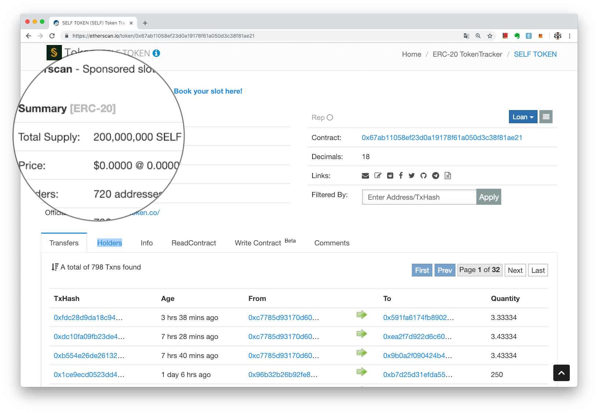
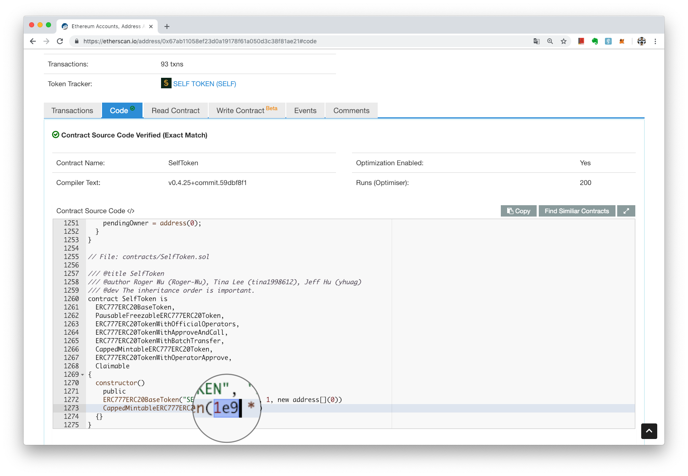

# 總供給量
> **最後更新：2026 年 1 月**

通證發行時，在智能合約裡限制其歷史流通的最高數量，稱作總供給量。

有時候，雖然在以太坊瀏覽器 Etherscan 上寫的 Total Supply 看起來是一個量，但實際上該通證代幣可能在合約裡還設定了一個更高的總量，只是分階段發行。

如 SELF TOKEN 目前的總供給量顯示在 Etherscan 上面是 200,000,000（兩億） SELF；但實際上看合約代碼就能發現歷史總量上限應該是 1,000,000,000（十億）SELF。

[https://etherscan.io/address/0x67ab11058ef23d0a19178f61a050d3c38f81ae21#code](https://etherscan.io/address/0x67ab11058ef23d0a19178f61a050d3c38f81ae21#code)\

---

#### 相關條目

<!-- TODO: 添加 3-5 個相關頁面連結 -->

#### 參考資料

<!-- TODO: 添加外部參考連結 -->
