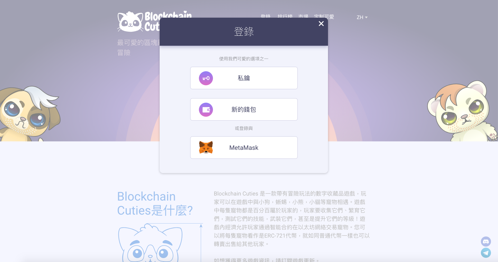
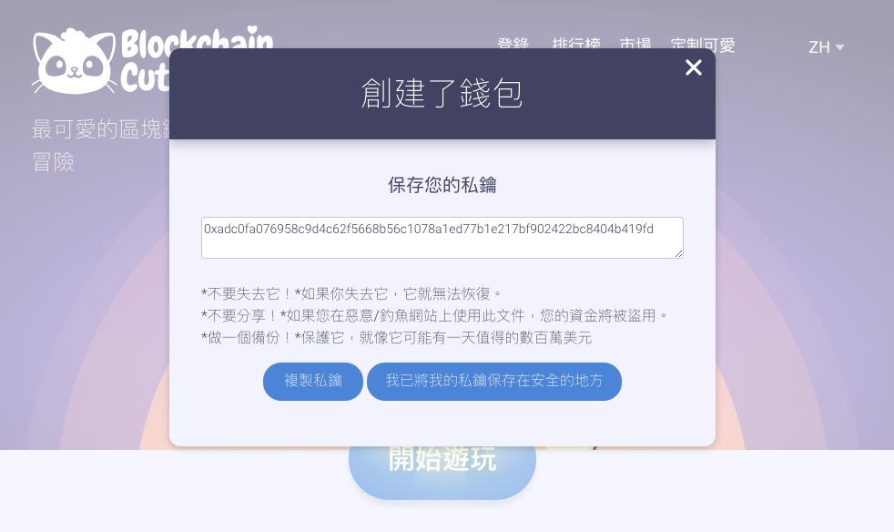

# 遊戲錢包

**遊戲錢包（Cryptogame Wallet），又可以稱作遊戲內加密錢包（英文：In-game Crypto Wallet），和一般加密錢包的差別是，這種錢包的私鑰一般不在消費者手裡，也不在交易所，而是在遊戲公司的雲端主機裡。**

有的遊戲錢包允許你匯出私鑰，讓你可以在其他裝置上導入錢包做其他用途，但其實在這狀態下，你的錢包私鑰還是「曾經存在」過在遊戲公司的雲端主機裡，我們甚至難以知道這組私鑰是不是在導出之後有進行清除，你就難以確認你是不是這世界上唯一擁有這組私鑰的人。

### 真錢包還假錢包

有些區塊鏈遊戲強調不需要瀏覽器外掛錢包，而是幫你做好了代管錢包的動作，這麼一來，就無論是 Safari 瀏覽器、Edge 還是 PS4 都能登入遊玩。例如底下的 BlockchainCuties 就是一例。

遊戲讓人可以用導入私鑰的方式登入遊戲，如果你沒有錢包，它也可以創建，並幫你建立私鑰。雖然系統說，它只會給你看一次，之後就會清除了，但你怎麼知道是真的呢？

另外，還有的區塊鏈遊戲號稱內建鏈上錢包，但是卻沒有將私鑰交給你，那很可能該遊戲背後根本沒有區塊鏈。驗證一個區塊鏈遊戲是否真的以區塊鏈錢包來運行，最簡單的方法就是要能取得私鑰，並且將私鑰匯入到私鑰錢包 App 以後，能看得到裡頭的貓咪、資產、道具等等，否則很可能是假冒的區塊鏈喔！

### 結論

一個區塊鏈遊戲如果號稱可以在雲平台上替你建立錢包，卻不把私鑰交給你，那很可能表示它根本沒有運行在區塊鏈上；但如果它能透過網頁將私鑰交給你，那也可能在顯示的過程，被瀏覽器裡的病毒或其他程式給截走，一樣不安全。

### 遊戲內建錢包，有中心化管理的問題，也可能有安全疑慮

因此一般認為，所有的錢包，只要不是自主掌管私鑰的「私鑰錢包」，都不建議存放太多數位資產，免得哪天交易所關門大吉，或是遊戲主機伺服器關閉，你的所有資產便完全消失。  

