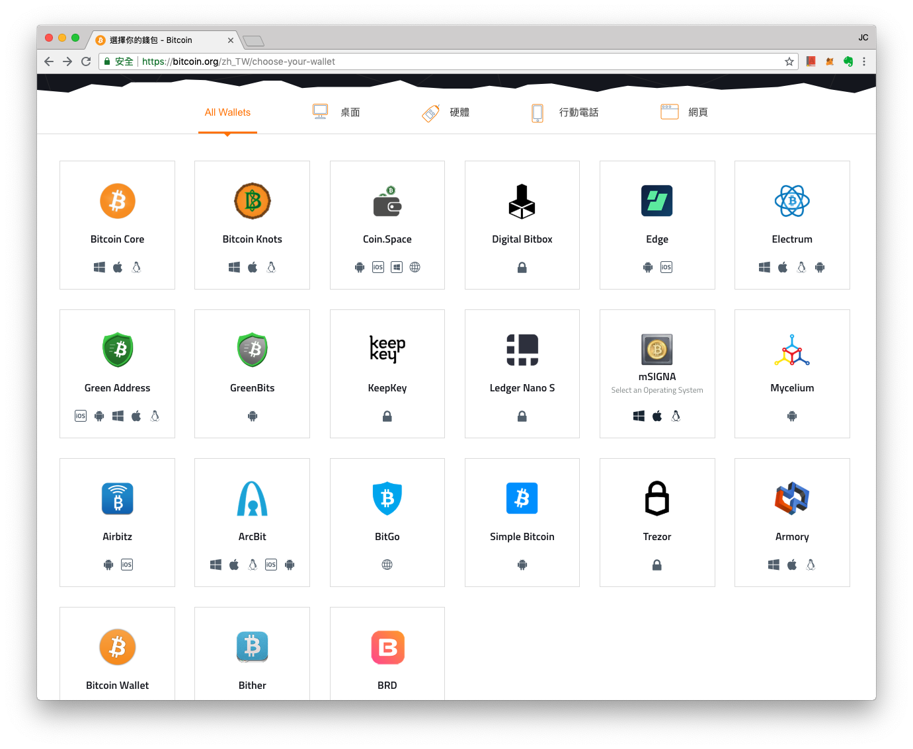

# 比特幣錢包

**比特幣錢包（英文：Botcoin Wallet）基本上和以太幣錢包類似，是連結著比特幣區塊鏈，存放比特幣的電子程式。**

因為比特幣區塊鏈並沒有智能合約和 ERC20 這種可以允許別人在同一個鏈上發行不同幣的機制，因此比特幣原生錢包內多半僅能存放比特幣。

比特幣基金會推薦的原生比特幣錢包[如下](https://bitcoin.org/zh\_TW/choose-your-wallet)：

\
事實上，除了最早的原生比特幣錢包「Bitcoin Core」之外，其餘錢包應用多半都已陸續加入了整合其他區塊鏈，得以同時存放其他幣和數位資產的功能。如寶博士使用的「Coinbase」或是「Coin Space」等，都成了所謂支援多種鏈的「聚合錢包」。

### 可以線上創建並匯出私鑰的 Coin Space


