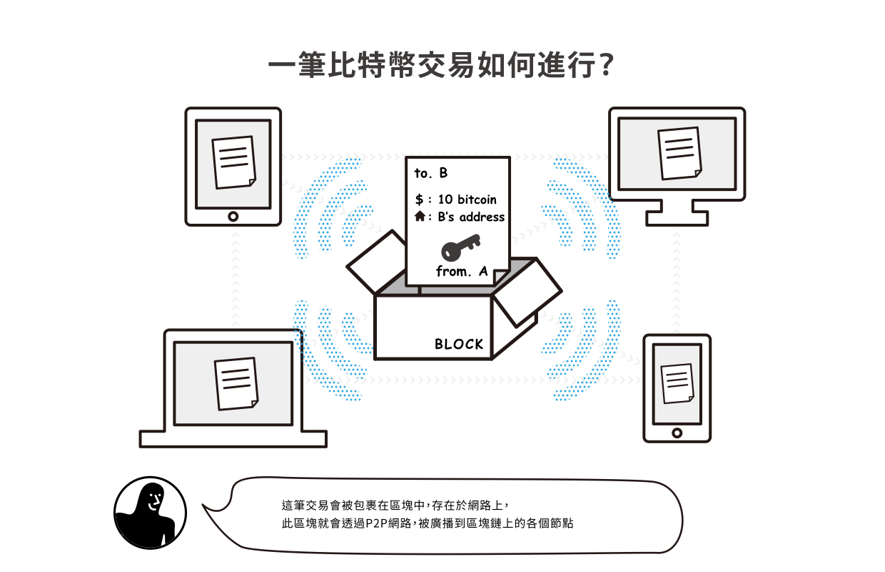
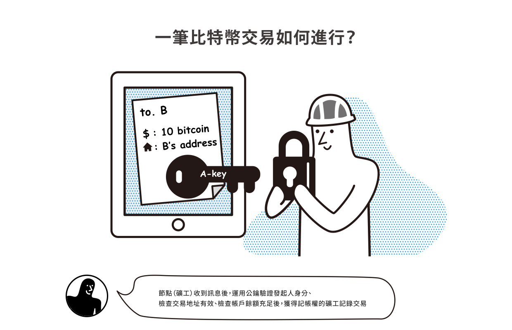
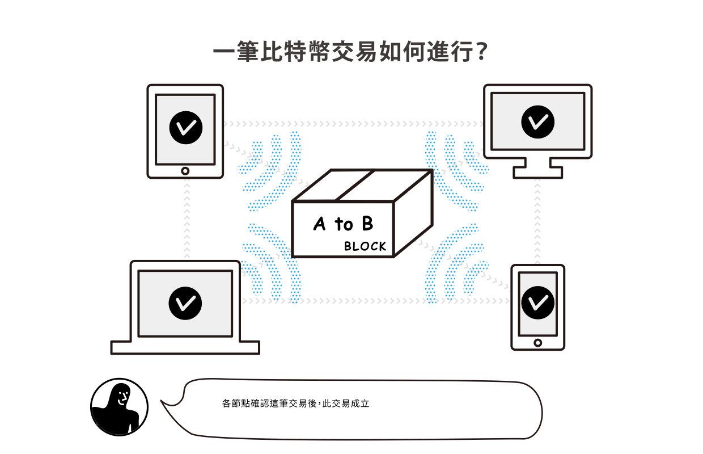
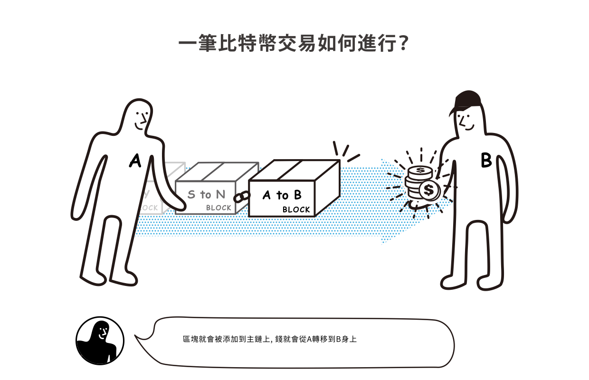

# 交易

**在區塊鏈世界中，我們把一個數位資產的交換，無論是收取或送出，甚至是使用錢包**[**簽名**](../ming/)**等動作，都叫做交易（英文：Transaction）。**

**這個交易有兩個層面：**

1. 兩個用戶間的資產作了轉移（例如 A 轉了 50 個比特幣給 B）
2. 區塊鏈上的礦工們（記帳員、小村長）接受記帳手續費，幫忙記帳（與交易發起人 A 發生了交易）

總而言之，廣義來說，一個用戶帶著私鑰，和區塊鏈網絡互動，作了記錄上的改變，就算是發生了一筆交易。狹義而言，就是有兩個用戶之間發生的價值轉移。

注意：區塊鏈數位資產錢包的交易，可以發生在自己身上。亦即透過電子錢包轉帳功能，可以自己轉帳給自己。這點在過去的銀行體系較少發生，但區塊鏈世界沒有限制。但發生該交易所需的[算力費用](../../wa/suan-li.md)，還是需要付給[礦工](../bi-te-bao/gong-yong.md)。

### **轉帳交易 vs 撮合交易 vs 合約交易？**

**只要資產發生了驗證/交換/易手等動作，都算是發生了交易。**

**「**轉帳交易」多半是單純的傳送或接收資產；「撮合交易」指得是在交易所或 OTC 平台上進行撮合買賣；而「合約交易」則是指用戶拿錢包帳戶和智能合約互動。

### 一筆交易如何進行？數位時代「300秒區塊鏈麻瓜大變身」圖解

在數位時代雜誌 2018 年區塊鏈特輯所製作的圖解裡頭，對於區塊鏈交易的流程說明得十分清楚。



### 一筆交易 = 帳務記錄更新

所謂區塊鏈上所進行的「交易」其實就是交易雙方的帳戶記錄互做修改。很多時候我們以為「交易」就是是資產的「交換」 - **我的錢移到妳那裏去了**，但其實不是，其實在區塊鏈上，沒有真的「轉移」什麼東西，而是帳本裡頭，**交易雙方的紀錄變更了**。例如：A 轉了 50 元給 B，其實是在區塊鏈帳本的記錄上，變更為：A 的資產減少 50 元，B 的資產增加 50 元。**區塊鏈只對妳我帳務記錄欄位上的資料進行紀錄更新，並沒有真的交換什麼東西**。這是非常重要的觀念，在「[比特幣](../../bi-te.md)」條目中也有提到過。

### 讓帳務記錄取代鈔票、帳務記錄更新取代鈔票轉移

就如同前面條目「幣」所說，錢財在社會的意義只是記錄每個人的工作所得，本來也就只是數字的增替更新而已，只不過以前沒有電腦，所以用「[Yap](../../currency.md#ya-pu-shi-yap)」這種石板幣或是帳本來完成，並創造**鈔票**來讓帳本之外（帳本不可能隨時帶在身上）交換帳務記錄可以更方便完成。久而久之，人們認為鈔票是必須的，就如同當年Yap 島嶼上的人覺得 Yap 石板幣也是必須的一樣。

### 區塊鏈交易不一定要是金錢交易

區塊鏈這個分散式帳本技術，不只可以記錄錢的交易，任何記錄上的變更，數字、資料的更替，也都可以用區塊鏈技術來達成可以信賴的記錄。

