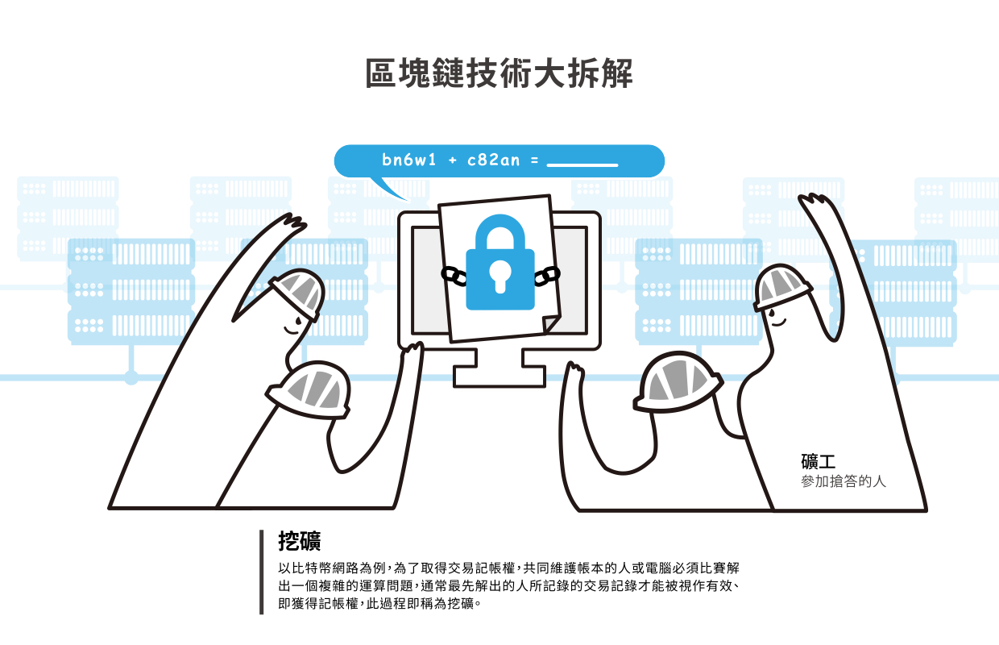

# 交易手續費
> **最後更新：2026 年 1 月**

**交易手續費（英文：Transaction Fee）為付給礦工 - 也就是區塊鏈網路上協助記帳的人的報酬，等同於記帳費。**某種程度上，也可以說是給替區塊鏈網路「提供電腦協助記帳的人」的 **電力、算力、網路費用補貼。**

在比特幣錢包程式裡，轉帳前系統會詢問要付多少「[礦工費](../bi-te-bao/gong-yong.md)」作為交易手續費；以太幣交易前，程式也會詢問你願意付多少「[瓦斯費用](../yi-tai-fang-bao/wa-si-ge.md)」，這些都是區塊鏈交易所必須付出的錢。

其實說穿了，和銀行跨行轉帳需要手續費是一樣的（同行轉帳免手續費只是銀行自己吸收了，人力費用一樣還是需要的）好處是，區塊鏈轉帳交易的手續費是動態的，用戶可以自行調整！手續費出得高，交易被完成的速度就快；手續費出得低，交易完成的等待時間就越長。

### 手續費與菜市場

交易手續費和區塊鏈記帳本、記帳員的關係，就像菜市場賣菜。當市場門口羅雀，生意很差，你走進去，大家都想跟你做生意，就各自殺價競爭；但要是市場門庭若市，所有人都忙不過來，生意好得不得了，那麼你就得出比較多的錢才能買到一樣的好商品。和演唱會搶票也非常類似。

如果這個區塊鏈上使用交易的人很少，礦工沒錢賺（沒有記帳費可拿），那麼平均交易手續費就會下降，因為你出一點點錢，礦工也願意替你工作。若是鏈上生意很好，很多交易發生，礦工忙不過來，排隊的人變多，交易手續費也就隨之提高（因為很多人願意多出一點手續費讓礦工幫他提早驗證交易）。

同樣的，若是在生意最好的時候，交易手續費居高不下，突然有更多的礦工、電腦加入記帳工作，那麼排隊人潮迅速解除，平均手續費又下降了。

所以，整體來講，影響交易手續費的條件主要有二：

1. 交易數量（等待被記帳的資料量）
2. 礦工數量（處理交易的機器和速度）

### 交易速度

正常情況下手續費是根據交易的數據量計價。目前以太坊的交易速限約每秒 20 筆交易，遠小於 VISA 每秒可以處理千筆交易的速度，所以使用以太坊或比特幣區塊鏈交易必須排隊。但因為每段時間使用的人數不同，在繁忙時段就會遇到塞車狀況，此時手續費單價給得越高的交易，就會越快被礦工記到區塊鏈上。

區塊鏈記帳員（礦工）每分每秒都在作著「搶記帳權」的工作，搶到了就可以幫忙記帳，也會獲得獎勵。此部份在「挖礦」條目會更詳細敘述。

#### 參考資料



---

#### 相關條目

* [送出交易](song-chu.md)
* [交易哈希](ha-xi.md)

#### 參考資料

<!-- TODO: 添加外部參考連結 -->
