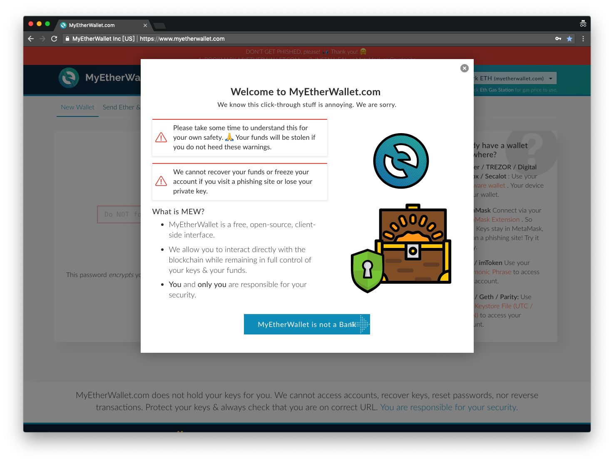
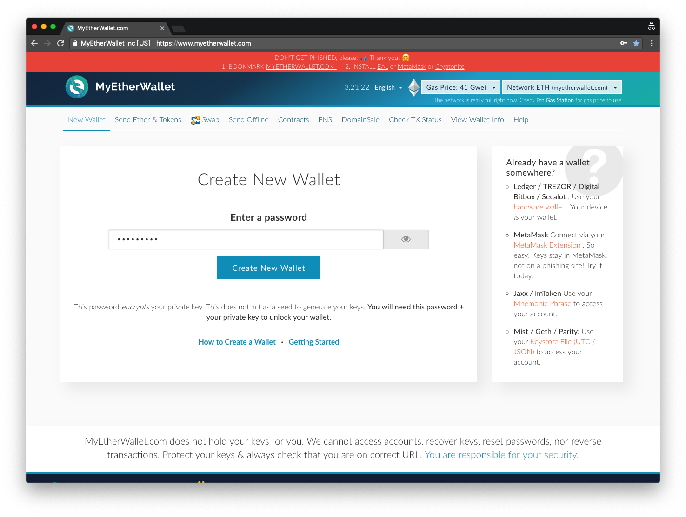
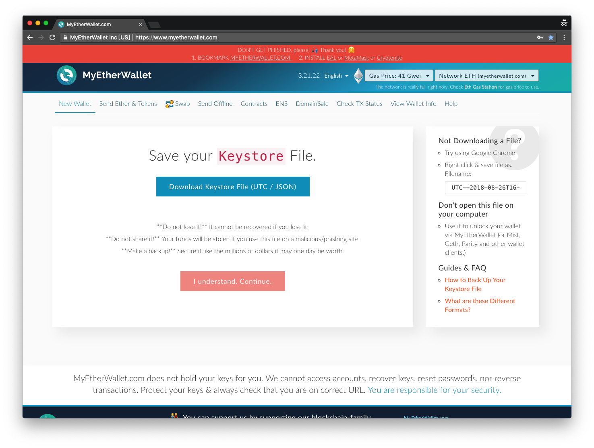
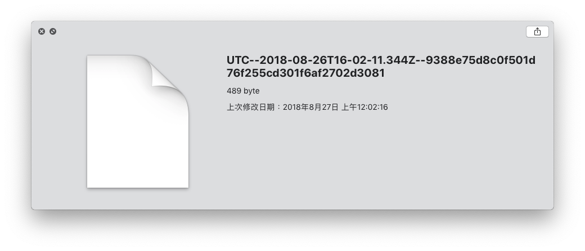
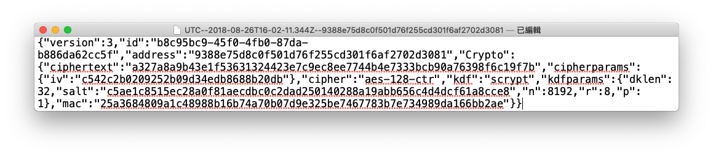
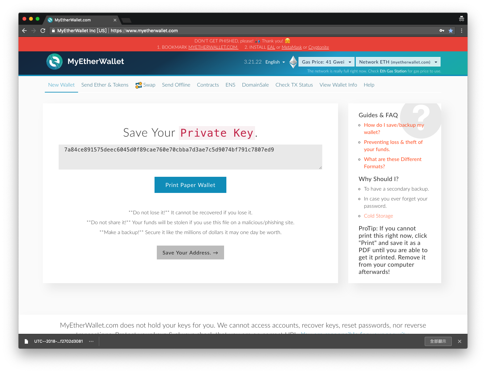
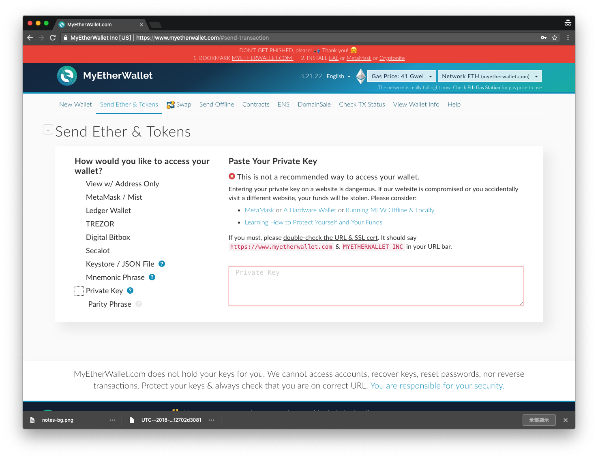
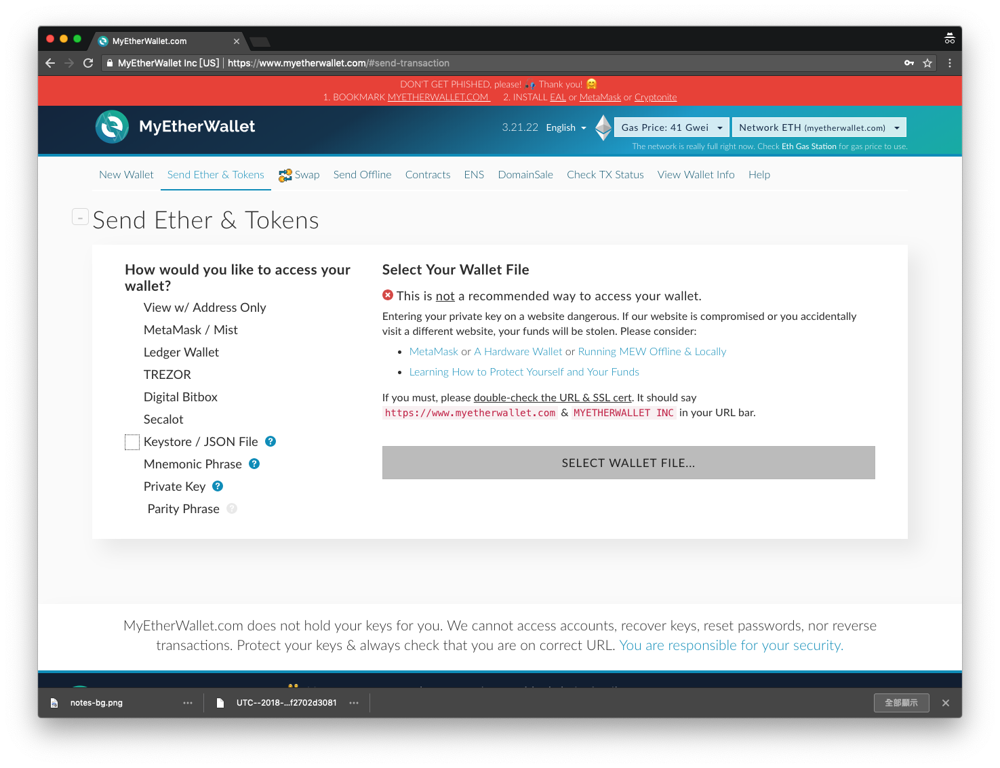

# MyEtherWallet

**MyEtherWallet 是最多人使用也最古老的以太坊線上錢包服務之一。**

2017 年數位資產發行正火熱時，許多發行方都會要求贊助者擁有自己的以太坊錢包地址，待資產發行後將幣（99.9% 是以太坊 ERC20 幣）發送到贊助者的錢包當中。因為這個原因，當年許多人進幣圈所創建的第一個錢包，多半是在 MyEtherWallet 這個網站完成的，簡稱 MEW。因為它是當時幾乎為一個只需要 Chrome 瀏覽器就能完成錢包創建，並取得錢包地址的地方，所以很多人都知道它，幾乎變成錢包的同義詞。所以你有時會聽到有人問「你的 MEW 地址是什麼？」其實就是在問錢包地址的意思。

首先，登入 [https://MyEtherWallet.com](https://myetherwallet.com) 你會發現它有著許多的警告。因為創建錢包的過程中，會有許多的風險，瀏覽器中毒、電腦被駭，都會讓你的私鑰有曝光的危險。所以所有能幫你創建錢包的服務，都會不斷強調「私鑰自己保管好，別弄丟」 「出事不關我的事」。

點選警告視窗的右上角小叉叉關閉後，創建錢包第一步，先輸入一個九位數以上的密碼。

接著網站會產生私鑰綁定密碼的 [Keystore](../../si/keystore.md) 給你。

產生出來的 Keystore 長這個樣子，是個 .JSON 檔名的檔案。用文字工具打開來看，裡面是一些字串碼，用 JSON 這種格式定義儲存起來。

接著會將私鑰顯示出來讓你複製保存：

如果點選「Print Paper Wallet」就是列印「[紙錢包](../../../bao-1.md)」，這麼一來只要把那張紙收好就可以隨時還原你的電子錢包在任何設備上。但萬一印表機裡有病毒呢？ ;)&#x20;

一切手續完成後，你就隨時可以點上方目錄裡的「Send Ether & Tokens」活頁，選擇左邊的「Private Key」，並在右邊欄位貼上你剛剛創建錢包時得到的私鑰字串，或是選左邊「Keystore / JSON File」

請注意，這兩種開啟錢包的方法，網站都用了紅色的叉叉，寫著：


**This is not a recommended way to access your wallet.** \
**不推薦使用此種方法進入錢包！**


原因剛剛說過，每次都把私鑰找出來，並且複製貼至到欄位上，或者把 Keystore 隨時放在電腦上傳到網站上去檢視錢包內容，過程中如果電腦有毒或是網站被駭，你的錢包所有權就隨時會被入侵，資產可能隨時被轉移。

怎麼辦呢？

看起來目前這些網站一致推薦的都是使用 [MetaMask](../../../untitled/metamask.md) 或是 [冷錢包](../../../cold-wallet/)如 [Ledger Wallet](../../../cold-wallet/ledger-nano.md)。

\
