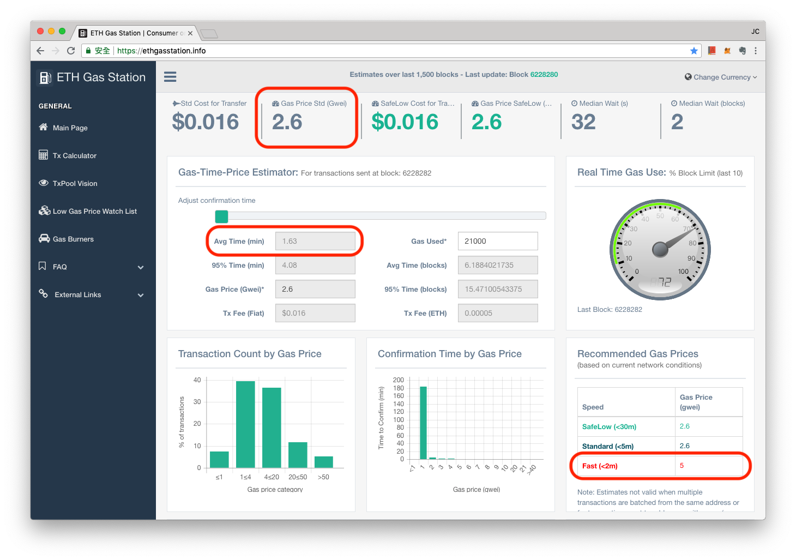
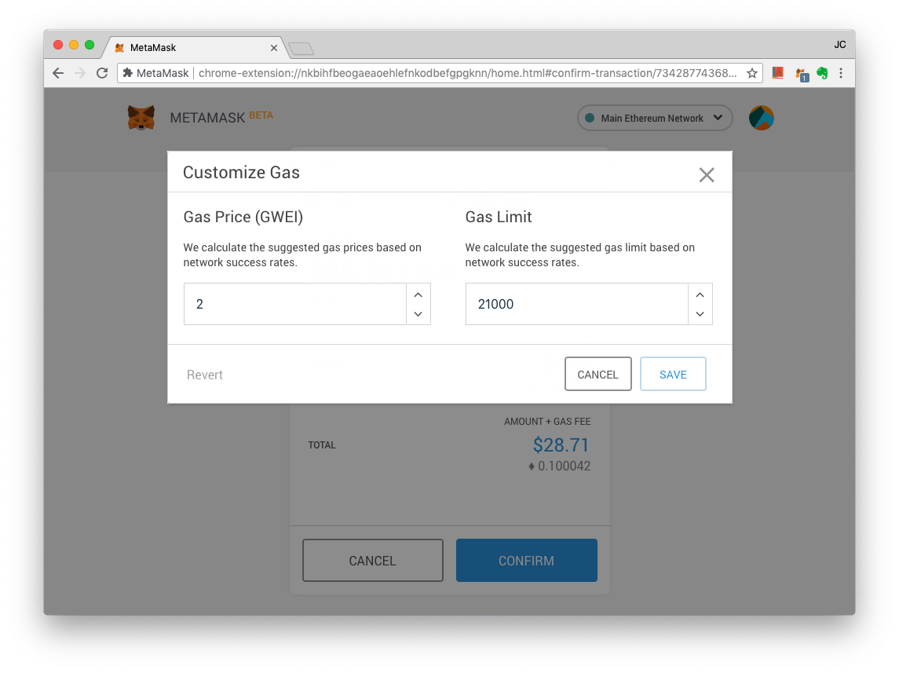

# 燃料價格

**燃料價格（英文：Gas Price）就是交易發起者願為燃料費所付出的單位價格，一律用以太幣計價。**

每次交易要用掉多少「燃料（Gas）」，本質上是一個虛擬單位，主要是把交易者所願意付出的「算力費用」數字化，而燃料價格，就是透過消費者的主動意識把這個算力數值「價格化」，代表在一筆交易在以太坊區塊鏈上每運算一步，發起交易者願意付出多少以太幣（ETH）。每單位燃料價格出得越高，交易速度就越快，完成交易的時間也就越短、越迅速。

燃料價格費用是用以太幣為計價做支付，且以 Gwei 做計算單位。Gwei 這個詞聽起來陌生，但多玩以太坊的人就知道了，每轉一次帳，每買一次謎戀貓，都要付以 Gwei 做計算的燃料費用。Gwei 就是某個微小數量的以太幣的單位。什麼是「微小數量」呢？現實生活中的台幣或美金，都有既定的「微小數量」稱呼。如，0.1 美金，又叫做 1 美分（Cent）；0.1 台幣，又叫做 1 毛錢。而 1 Gwei 就是 0.000000001 ETH。

### 燃料價格 = 發起交易者，願意為每步計算付出多少錢

前面說過，燃料是為了讓以太坊的礦工替交易記錄工作而付出的費用，因此，每次交易，都要付出「步數 x 價格」的費用作為交易手續費。

**實際交易手續費（**[**Tx**](../undefined/) **Fee）= 實際運行步數（Actual Gas Used）x  每步運算的價錢（Gas Price）**

例如你要以太坊礦工替你完成 5 步的運算，而 Gas Price 設定 20 Gwei，那麼整個交易就需要耗費 5 \* 2 = 100 Gwei 的燃料（算力費用）了，也就是付了 0.0000001 以太幣。

### 如何決定燃料價格？

以太坊的去中心化及分散式礦工（記帳者）的設計，允許同樣的一筆交易，願意出比較多燃料費的人，可比其他出較低燃料費用的人更快完成交易。有點像礦工隨時都在搶願意出高價讓他挖礦（驗證）的人。

**那... 如果很多人同時想要進行交易，而且都想要趕快被驗證，完成交易，那會發生什麼事？**

沒錯，交易費用就會上升，因為所有人都想提高燃料單價來引誘礦工優先替自己工作；反之，如果都某個時間之內，以太坊網路很冷清，都沒有人發出交易，又或者，突然間多了很多新礦工，殺價競爭，那麼發起交易者，便只需一點點的燃料費，就能讓交易被驗證完成。也就是說：以太坊網路交易費（平均 Gas Price）下降了。

### 平均 Gas Price

要怎麼知道現在以太坊網路是冷清還是熱鬧？如果在冷清的時候我出了過高的燃料費，礦工就多賺了；如果我再熱鬧的時候出了過少的燃料費，那我的交易就會延遲很久（有時候甚至達到數天）才被驗證記錄上鏈。

不必擔心！因為以太坊區塊鏈完全透明、去中心化的架構，當然可以知道現在的交易是熱絡還是冷清。

在這個頁面裡， Etherscan 公司就提供了平均燃料價格檢視工具 [https://ethgasstation.info/](https://ethgasstation.info/) 來視覺化地告訴使用者現在的平均燃料價格（Gas Price Standard），如同加油站在加油時會告訴你這個地區目前的油價如何：



例如下面這張圖是筆者寫作時的以太坊網路現狀及燃料費狀態，**平均每筆燃料費用是 2.6 Gwei，而且只要付出足夠的燃料量 x 平均燃料價格（2.6 Gwei），就可以在大約在 1.63 分鐘內完成交易驗證**。

以太坊網路很貼心，對於總是精打細算的使用者，也很照顧到。「如果我能清楚知道整個網路現在礦工工作狀態，發起交易的數量，以及大家願意付出的燃料費用」那麼我們就能知道付多少燃料費，可以排多前面完成交易。總之，「燃料費用」就像以太坊網路的使用費、轉帳手續費，過去銀行也跟我們收取這些費用，但我們無法要求行員以我們對帳務處理的快慢來調整費用收多還是收少。這件事，以太坊區塊鏈本著去中心化、透明記錄和共識演算的精神，做到了。

### 燃料價格自動設定

絕大多數的以太坊應用程式都會自動偵測網路使用狀態，自動給予燃料價格設定的建議。例如：

這是筆者現在使用「MetaMask」想要發起一筆轉帳時，MetaMask 軟體向以太坊網路詢問得到的燃料價格建議：2 Gwei。而燃料上限則會依據交易複雜度不同而給予建議。兩者相乘，就會得到這次交易使用者願意付出的交易費用最大上限金額（此例為：2 Gwei x 21000 = 42000 Gwei = 0.000042 ETH，以現價 1ETH = 300 美金，便是約等於 0.000042 ETH x 300 $USD x 台幣匯率 30:1 美金 = 0.378 新台幣）。


**小技巧**：因為每一時每一刻以太坊網路的狀態都在改變，現在很冷清，可能下一秒就衝進來許多人和許多新的交易。如果每次交易都設定在剛剛好網路推薦給你的 Gas Price，那麼可能發生網路突然爆量的情況時，你的交易就會被排在很後面，得等前面衝進來的所有交易都記錄完畢，才輪到你。這種情形下，寶博士一般都會在 Gas Price 的建議數值上，增加 1~2 Gwei，來確保不會因為網路突然塞車，你發出的交易得等好幾天才完成。



**小故事**：寶博士曾在某次演講要灑幣時，不小心把合約部署上鏈的交易費用降低了 1~2 Gwei，導致當天演講完全無法針對這個錢包做任何操作，因為只要有一次交易卡住，就會導致該錢包後面全部的交易都卡住。那天卡了好幾個小時，下午的演講到了隔天交易才順利完成上鏈！



小秘技：針對可能不小心卡住交易，導致某個錢包在以太坊網路塞車解除前變成完全不能用。有技術大神寫了一篇這樣的文章和相關工具：




