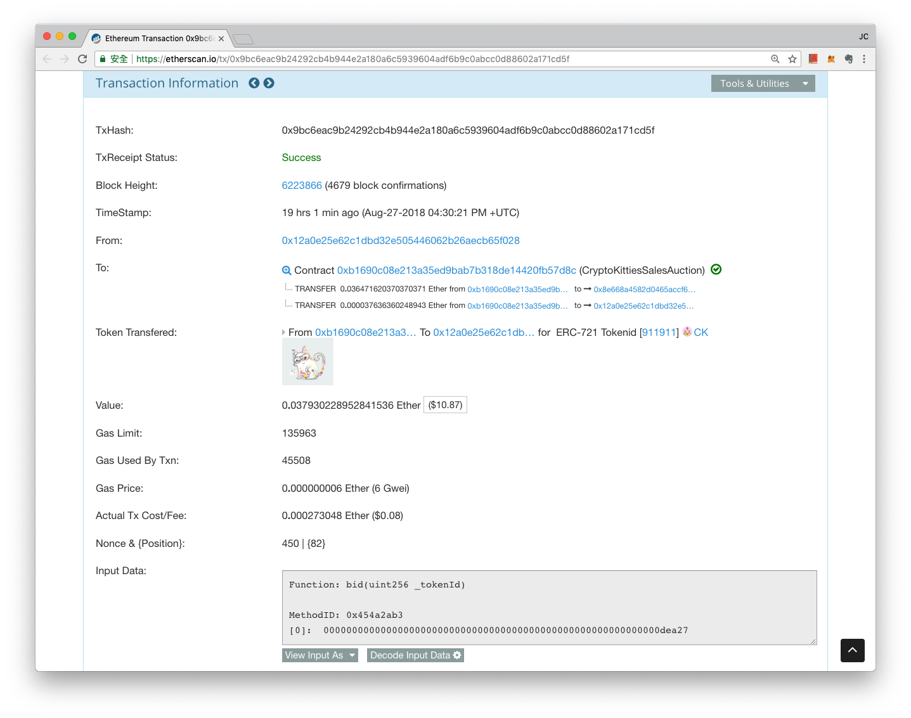

# 燃料上限

**燃料上限（英文：Gas Limit）**指的是一筆交易當中，發起交易者願意付出的燃料量上限，同時也是以太坊計算這筆交易所需計算步數的安全下限。

簡單講，在以太坊上要完成一筆交易，只要付出相等於「燃料上限」的燃料量（計算步數），這筆交易就能成功上鏈。然而，我們要如何知道一筆交易需要多少計算步數呢？答案是，以太坊區塊鏈會先免費幫你模擬和偵測你即將發出的這筆交易需要多少計算。

為了不讓計算有誤導致使用者交易失敗，網路所推估的計算步數通常會高估一些！讓使用者可以預先同意該筆交易的完成，會需要「燃料上限」x 「燃料價格」的總費用。

### 多退少不補！

就像寶老闆吩咐秘書去銀行轉帳，對秘書說「給你兩千塊，幫我完成這件事，多退少補！」燃料上限也是類似這樣，只不過差異在於，以太坊的燃料一旦在送出交易的時候預設好，萬一燃料用完了，任務（計算）還沒完成，這燃料費可是**多退少不能補**的，**因為礦工還是替你工作了，只是沒有 "完成工作" 而已**，而且交易會失敗，無法記錄上鏈。

所以，以太坊區塊鏈系統很貼心的設計了這個機制，讓交易者每次發起交易的時候，系統都會協助推估並設定這筆交易所需要的燃料上限，再讓使用者依據交易速度需求，設定每個燃料（算力）單位的價格，之後送出交易，就可以順利完成交易。

### 認養一隻貓

預設的一般交易 Gas Limit 通常是 21,000，而如果是比較複雜的交易譬如參與數位資產發行認購，或是認養一只迷戀貓，那麼 Gas Limit 很可能會高出幾倍來到 150,000 這麼多。實際案例我們來看看這個「寶博士認養一只迷戀貓」在[以太坊交易檢視網站 Etherscan 上的紀錄](https://etherscan.io/tx/0x9bc6eac9b24292cb4b944e2a180a6c5939604adf6b9c0abcc0d88602a171cd5f)吧！

寶博士在 2018/8/28 在以太坊區塊鏈遊戲「迷戀貓」上認養了一隻紀念貓「Purrity」：

**Value: 0.037930228952841536（整筆交易所付出的費用：貓咪認養價格加上交易手續費）**

**Ether Gas Limit: 135963（系統推估的燃料上限）**

**Gas Used By Txn: 45508（實際所用到的燃料數量，也可以說是實際計算的步數）**

**Gas Price: 0.000000006 Ether \(6 Gwei\)（燃料價格）**

**Actual Tx Cost/Fee: 0.000273048 Ether \($0.08\)**

實際花費的交易手續費為：實際用到燃料量 45508 x 使用者設定燃料價格 6 Gwei = 273048 Gwei = 0.000273048 ETH，依據當天以太幣價格，大約等於 0.08 美金，也就是 2.4 塊台幣。

