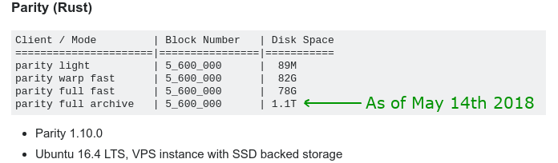

# 以太坊

**以太坊（英文：Ethereum）是一種區塊鏈技術，於 2013 至 2014 年間程式設計師** [**維塔利克·布特林（英文：Vitalik Buterin）**](mi-yin/vitalikv-shen.md)**受比特幣啟發後提出，號稱要打造「下一個世代的比特幣」。**藉由這個技術，人人可以發行自己的虛擬貨幣，並且共用以太坊的分散帳本，將交易記錄寫在同一個區塊鏈分散式帳本上。

目前以太坊區塊鏈帳本的頁數大概是：603 萬頁，約佔硬碟空間 78 GB，如果是 [全節點](dev/node/quan.md) （整個帳本一字不漏）備份則是 1TB。

### 以太坊的算力權利金

使用以太坊區塊鏈，是要付授權費/使用費的（給付給礦工和以太坊），它不收任何既有的法定貨幣，如人民幣、美金等，而是只收藉由這個同一個（以太坊）技術發行的鏈上貨幣，亦即「以太幣（英文：Ether）」。

### 以太坊 vs 以太幣？

許多媒體經常在引用時混淆兩者「以太坊」及「以太幣」，有些人甚至誤以為以太幣有兩種翻譯方式，一個為以太坊，一個是以太幣。造成這個混淆的主要原因之一，可能是以太坊的英文為 "Ethereum"，而以太幣的英文為其縮寫 "Ether"，在交易所或錢包裡的通證代號一般為 "ETH"，因此造成許多人以為以太幣（Ether, ETH）的全名就是 Ethereum。但事實上這是一個誤解。

正確的認知是：「以太坊是一個區塊鏈技術，使用該技術所架設的區塊鏈[主網](dev/mainnet.md)內，唯一接受的貨幣（用以支付授權金、使用費）即是[以太幣](yi-tai.md)。」

以下是一些正確和錯誤用法的比較，[來自知乎](https://zhuanlan.zhihu.com/p/28994731)：

❌ 我購買了5個以太坊

✅ 我購買了5個以太幣

❌ 以太坊價格又漲了

✅ 以太幣價格又漲了

❌ 以太幣的區塊鏈

✅ 以太坊的區塊鏈

### 以太坊基金會

由於整個以太坊開發和以太幣的預售，在法律和金融層面擁有一定程度的複雜性，導致一些法律實體需要被創建，其中包括以太坊基金會（英文：Ethereum Foundation）於 2014 年 6 月創建於瑞士的 Zug（即「[加密谷](qi-ta/jia-mi-gu.md)」）。

### 發展路線圖

以太坊公鏈在2015年7月30日啟動，最初的以太坊版本稱為邊境（Frontier）。就當初的發展藍圖來看，以太坊的開發會經歷四個版本，其中階段的轉換會以硬分叉來實現：

* 邊境（Frontier，2015年7月）
* 家園（Homestead，2016年3月）
* 大都會（Metropolis，2019年2月）
* 寧靜（Serenity，開發中）

#### 邊境

以太坊最早的版本，使用工作量證明（PoW）演算法。

#### 家園

經過了數次分叉之後釋出的穩定版本，這個階段還沒有明顯的技術更新。

#### 大都會

1. zk-Snarks（Zero-Knowledge Succinct Non-Interactive Argument of Knowledge）「簡單不交叉的零知識證明」。
2. 實施 PoS 的早期工作：採用 Casper 共識演算法
3. 改善智能合約的 gas 消耗機制
4. 以**抽象帳戶**的概念統一外部帳戶和合約帳戶，不再區分兩者。

#### 寧靜

以太坊的最終版本「寧靜」，或稱作「以太坊 2.0」，除了會從 PoW 更新為 PoS之外，將會從底層完全翻新以太坊，並專注於改進以太坊網路的可拓展性、效率以及去中心化程度。另外，還會部署一個新的虛擬機，這對開發者更具吸引力，因為它將支持更多的程式語言，並讓執行速度更快。

以太坊2.0還將支援對分片鏈的以及其他新型的鏈，這些鏈將支持基於獨特用戶需求的隱私，權限和治理模型等等。



